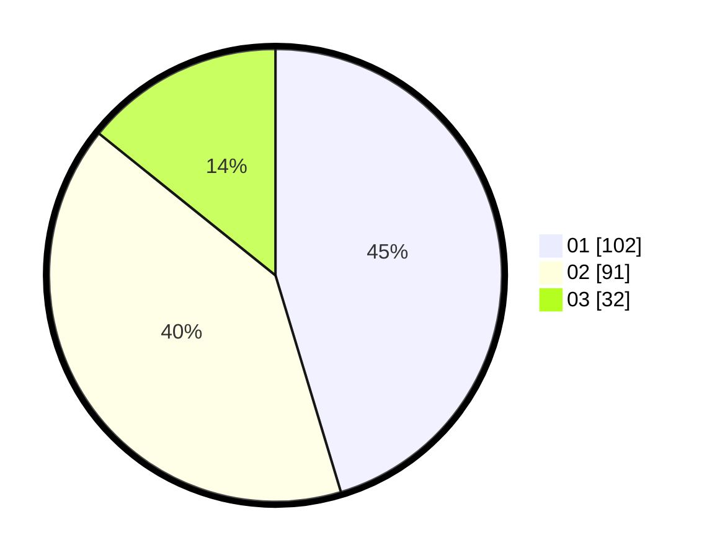

# Hasil

Hasil perolehan suara paslon dapat dilihat pada file paslon-01.txt, paslon-02.txt, dan paslon-03.txt.

Jika tidak ada, artinya data tersebut belum ada pada SIREKAP.

## Perolehan Suara

 * Paslon 01: **102**.
 * Paslon 02: **91**.
 * Paslon 03: **32**.

## Foto C Plano

https://sirekap-obj-formc.kpu.go.id/afb0/pemilu/ppwp/31/75/07/10/06/3175071006092-20240216-013851--e3bf2829-83b2-472e-b469-eed373cab47f.jpg

https://sirekap-obj-formc.kpu.go.id/afb0/pemilu/ppwp/31/75/07/10/06/3175071006092-20240216-013900--19ab4156-5c3f-4120-97dd-a4c91a51c593.jpg

https://sirekap-obj-formc.kpu.go.id/afb0/pemilu/ppwp/31/75/07/10/06/3175071006092-20240216-013857--13840280-88c6-4b83-82d3-b1d3e9441469.jpg

## DATA PEMILIH TETAP

Jumlah pemilih dalam DPT: **0**.
 * L: **0**.
 * P: **0**.

## DATA PENGGUNA HAK PILIH

Jumlah pengguna hak pilih dalam DPT: **0**.
 * L: **0**.
 * P: **0**.

Jumlah pengguna hak pilih dalam DPTb: **0**.
 * L: **0**.
 * P: **0**.

Jumlah pengguna hak pilih dalam DPK: **0**.
 * L: **0**.
 * P: **0**.

Jumlah pengguna hak pilih: **0**.
 * L: **0**.
 * P: **0**.

## JUMLAH SUARA SAH DAN TIDAK SAH

JUMLAH SELURUH SUARA SAH: **225**.

JUMLAH SUARA TIDAK SAH: **2**.

JUMLAH SELURUH SUARA SAH DAN SUARA TIDAK SAH: **227**.
