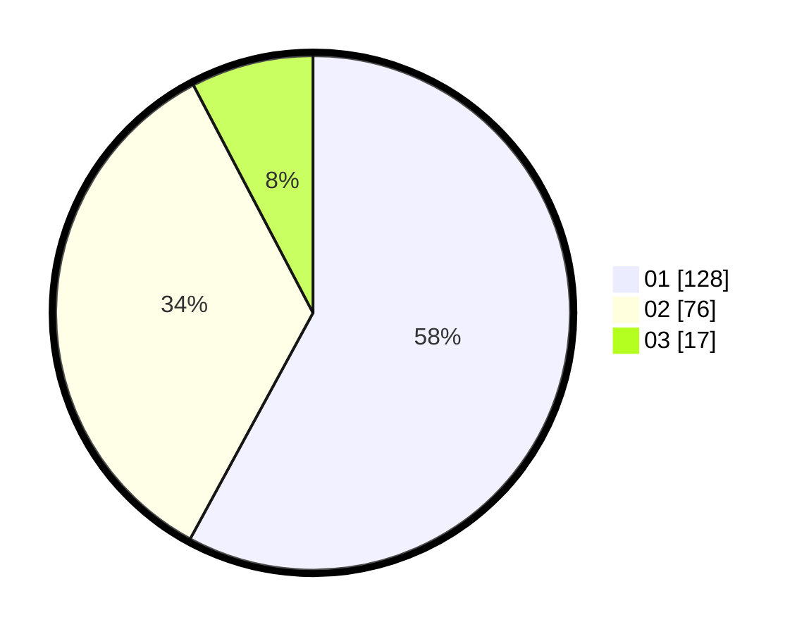

# Hasil

Hasil perolehan suara paslon dapat dilihat pada file paslon-01.txt, paslon-02.txt, dan paslon-03.txt.

Jika tidak ada, artinya data tersebut belum ada pada SIREKAP.

## Perolehan Suara

 * Paslon 01: **128**.
 * Paslon 02: **76**.
 * Paslon 03: **17**.

## Foto C Plano

https://sirekap-obj-formc.kpu.go.id/684b/pemilu/ppwp/31/75/07/10/06/3175071006094-20240217-110104--ee33bdf6-322d-453e-8e67-753128bda77b.jpg

https://sirekap-obj-formc.kpu.go.id/684b/pemilu/ppwp/31/75/07/10/06/3175071006094-20240215-180158--411ede05-66eb-4a72-b8ce-3a2171355988.jpg

https://sirekap-obj-formc.kpu.go.id/684b/pemilu/ppwp/31/75/07/10/06/3175071006094-20240215-180241--5d7ada6b-161c-4196-a960-0eea51393e81.jpg
