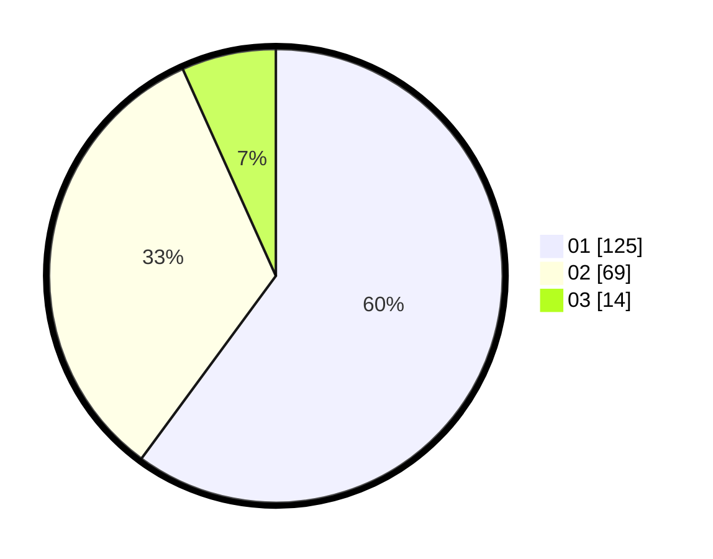

# Hasil

Hasil perolehan suara paslon dapat dilihat pada file paslon-01.txt, paslon-02.txt, dan paslon-03.txt.

Jika tidak ada, artinya data tersebut belum ada pada SIREKAP.

## Perolehan Suara

 * Paslon 01: **125**.
 * Paslon 02: **69**.
 * Paslon 03: **14**.

## Foto C Plano

https://sirekap-obj-formc.kpu.go.id/f71f/pemilu/ppwp/31/75/07/10/06/3175071006095-20240214-155639--4ead97f2-4fe7-4fa0-864e-a6d29e9ba489.jpg

https://sirekap-obj-formc.kpu.go.id/f71f/pemilu/ppwp/31/75/07/10/06/3175071006095-20240214-160058--a04125d4-3aa5-4516-8f78-f0b468ac07b5.jpg

https://sirekap-obj-formc.kpu.go.id/f71f/pemilu/ppwp/31/75/07/10/06/3175071006095-20240216-142258--5be886df-e08c-4711-9912-85853d6b44a7.jpg

## DATA PEMILIH TETAP

Jumlah pemilih dalam DPT: **266**.
 * L: **135**.
 * P: **131**.

## DATA PENGGUNA HAK PILIH

Jumlah pengguna hak pilih dalam DPT: **210**.
 * L: **102**.
 * P: **108**.

Jumlah pengguna hak pilih dalam DPTb: **1**.
 * L: **1**.
 * P: **0**.

Jumlah pengguna hak pilih dalam DPK: **0**.
 * L: **0**.
 * P: **0**.

Jumlah pengguna hak pilih: **211**.
 * L: **103**.
 * P: **108**.

## JUMLAH SUARA SAH DAN TIDAK SAH

JUMLAH SELURUH SUARA SAH: **208**.

JUMLAH SUARA TIDAK SAH: **3**.

JUMLAH SELURUH SUARA SAH DAN SUARA TIDAK SAH: **211**.
