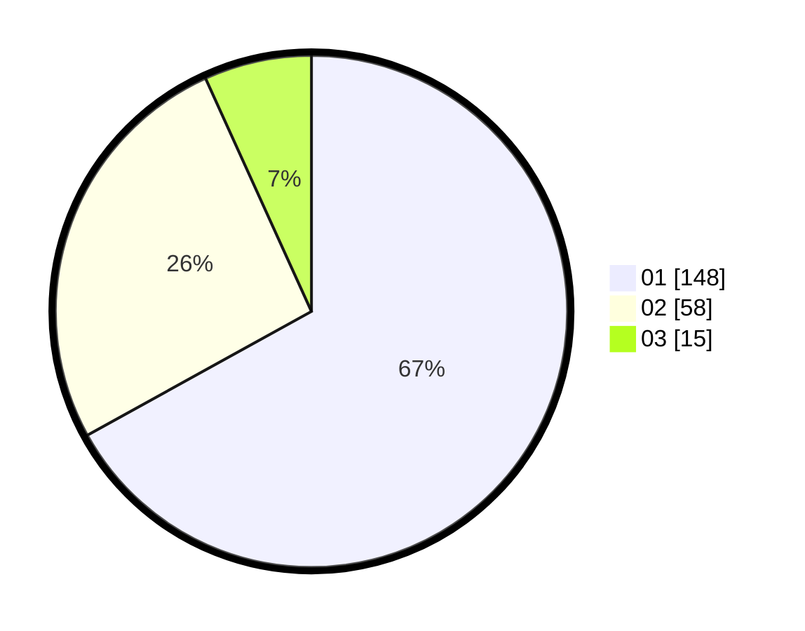

# Hasil

Hasil perolehan suara paslon dapat dilihat pada file paslon-01.txt, paslon-02.txt, dan paslon-03.txt.

Jika tidak ada, artinya data tersebut belum ada pada SIREKAP.

## Perolehan Suara

 * Paslon 01: **148**.
 * Paslon 02: **58**.
 * Paslon 03: **15**.

## Foto C Plano

https://sirekap-obj-formc.kpu.go.id/a2dc/pemilu/ppwp/31/75/07/10/06/3175071006096-20240215-225119--ed40f1fe-b977-4a73-9a51-b3c3100a4cb3.jpg

https://sirekap-obj-formc.kpu.go.id/a2dc/pemilu/ppwp/31/75/07/10/06/3175071006096-20240215-225121--9e351d5d-152a-46b5-8c8c-8b23a1991fa2.jpg

https://sirekap-obj-formc.kpu.go.id/a2dc/pemilu/ppwp/31/75/07/10/06/3175071006096-20240215-225120--ebe870eb-013a-4970-9cdc-5d9493f85e39.jpg

## DATA PEMILIH TETAP

Jumlah pemilih dalam DPT: **271**.
 * L: **139**.
 * P: **132**.

## DATA PENGGUNA HAK PILIH

Jumlah pengguna hak pilih dalam DPT: **227**.
 * L: **112**.
 * P: **115**.

Jumlah pengguna hak pilih dalam DPTb: **2**.
 * L: **1**.
 * P: **1**.

Jumlah pengguna hak pilih dalam DPK: **0**.
 * L: **0**.
 * P: **0**.

Jumlah pengguna hak pilih: **229**.
 * L: **113**.
 * P: **116**.

## JUMLAH SUARA SAH DAN TIDAK SAH

JUMLAH SELURUH SUARA SAH: **221**.

JUMLAH SUARA TIDAK SAH: **8**.

JUMLAH SELURUH SUARA SAH DAN SUARA TIDAK SAH: **229**.
