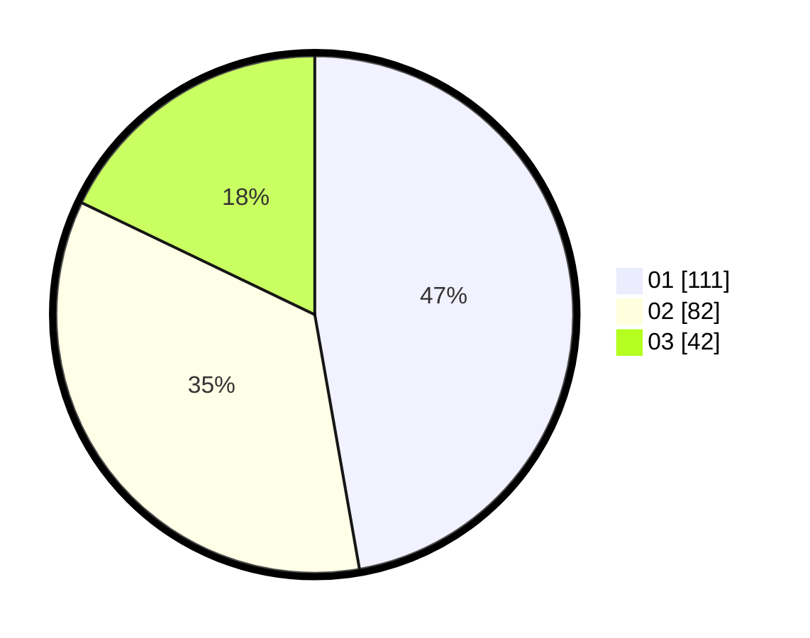

# Hasil

Hasil perolehan suara paslon dapat dilihat pada file paslon-01.txt, paslon-02.txt, dan paslon-03.txt.

Jika tidak ada, artinya data tersebut belum ada pada SIREKAP.

## Perolehan Suara

 * Paslon 01: **111**.
 * Paslon 02: **82**.
 * Paslon 03: **42**.

## Foto C Plano

https://sirekap-obj-formc.kpu.go.id/b07f/pemilu/ppwp/31/75/07/10/06/3175071006098-20240214-185820--121b2ad6-8acb-4957-b4c1-12a13e4506a0.jpg

https://sirekap-obj-formc.kpu.go.id/b07f/pemilu/ppwp/31/75/07/10/06/3175071006098-20240214-190059--8316e3c3-0a4a-4b3e-8879-490ba478756d.jpg

https://sirekap-obj-formc.kpu.go.id/b07f/pemilu/ppwp/31/75/07/10/06/3175071006098-20240214-190206--8c46a1ec-a39f-42b6-a8a6-46a9050527ba.jpg

## DATA PEMILIH TETAP

Jumlah pemilih dalam DPT: **278**.
 * L: **132**.
 * P: **146**.

## DATA PENGGUNA HAK PILIH

Jumlah pengguna hak pilih dalam DPT: **235**.
 * L: **112**.
 * P: **123**.

Jumlah pengguna hak pilih dalam DPTb: **2**.
 * L: **1**.
 * P: **1**.

Jumlah pengguna hak pilih dalam DPK: **0**.
 * L: **0**.
 * P: **0**.

Jumlah pengguna hak pilih: **237**.
 * L: **113**.
 * P: **124**.

## JUMLAH SUARA SAH DAN TIDAK SAH

JUMLAH SELURUH SUARA SAH: **235**.

JUMLAH SUARA TIDAK SAH: **2**.

JUMLAH SELURUH SUARA SAH DAN SUARA TIDAK SAH: **237**.
