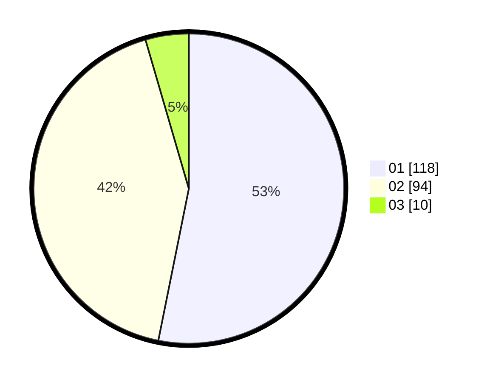

# Hasil

Hasil perolehan suara paslon dapat dilihat pada file paslon-01.txt, paslon-02.txt, dan paslon-03.txt.

Jika tidak ada, artinya data tersebut belum ada pada SIREKAP.

## Perolehan Suara

 * Paslon 01: **118**.
 * Paslon 02: **94**.
 * Paslon 03: **10**.

## Foto C Plano

https://sirekap-obj-formc.kpu.go.id/96a9/pemilu/ppwp/31/75/07/10/06/3175071006100-20240216-111933--c1e86588-0c10-4e8a-93bb-4a973a281e0b.jpg

https://sirekap-obj-formc.kpu.go.id/96a9/pemilu/ppwp/31/75/07/10/06/3175071006100-20240216-111935--44eed7a1-6498-4aef-8cf4-08e46589d8a0.jpg

https://sirekap-obj-formc.kpu.go.id/96a9/pemilu/ppwp/31/75/07/10/06/3175071006100-20240216-111934--77aedc20-7dae-4d0e-9d4f-212999bf12f4.jpg

## DATA PEMILIH TETAP

Jumlah pemilih dalam DPT: **269**.
 * L: **129**.
 * P: **140**.

## DATA PENGGUNA HAK PILIH

Jumlah pengguna hak pilih dalam DPT: **227**.
 * L: **103**.
 * P: **124**.

Jumlah pengguna hak pilih dalam DPTb: **0**.
 * L: **0**.
 * P: **0**.

Jumlah pengguna hak pilih dalam DPK: **0**.
 * L: **0**.
 * P: **0**.

Jumlah pengguna hak pilih: **227**.
 * L: **103**.
 * P: **124**.

## JUMLAH SUARA SAH DAN TIDAK SAH

JUMLAH SELURUH SUARA SAH: **222**.

JUMLAH SUARA TIDAK SAH: **5**.

JUMLAH SELURUH SUARA SAH DAN SUARA TIDAK SAH: **227**.
