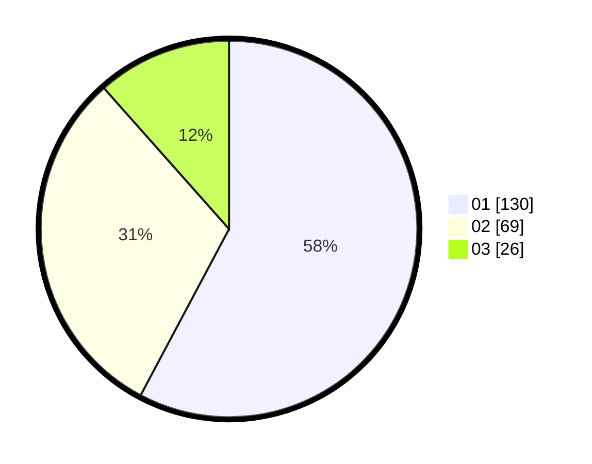

# Hasil

Hasil perolehan suara paslon dapat dilihat pada file paslon-01.txt, paslon-02.txt, dan paslon-03.txt.

Jika tidak ada, artinya data tersebut belum ada pada SIREKAP.

## Perolehan Suara

 * Paslon 01: **130**.
 * Paslon 02: **69**.
 * Paslon 03: **26**.

## Foto C Plano

https://sirekap-obj-formc.kpu.go.id/741b/pemilu/ppwp/31/75/07/10/06/3175071006101-20240214-192021--7074debd-b224-49fc-a28e-6c1baddc5a94.jpg

https://sirekap-obj-formc.kpu.go.id/741b/pemilu/ppwp/31/75/07/10/06/3175071006101-20240214-195322--f75e2259-324c-4d9f-aa56-ba031f6050a8.jpg

https://sirekap-obj-formc.kpu.go.id/741b/pemilu/ppwp/31/75/07/10/06/3175071006101-20240214-195337--0512fd76-cef8-4edf-a55d-16d9fb4d54ec.jpg

## DATA PEMILIH TETAP

Jumlah pemilih dalam DPT: **22**.
 * L: **0**.
 * P: **22**.

## DATA PENGGUNA HAK PILIH

Jumlah pengguna hak pilih dalam DPT: **224**.
 * L: **100**.
 * P: **124**.

Jumlah pengguna hak pilih dalam DPTb: **2**.
 * L: **1**.
 * P: **1**.

Jumlah pengguna hak pilih dalam DPK: **2**.
 * L: **2**.
 * P: **0**.

Jumlah pengguna hak pilih: **228**.
 * L: **103**.
 * P: **125**.

## JUMLAH SUARA SAH DAN TIDAK SAH

JUMLAH SELURUH SUARA SAH: **225**.

JUMLAH SUARA TIDAK SAH: **3**.

JUMLAH SELURUH SUARA SAH DAN SUARA TIDAK SAH: **228**.
