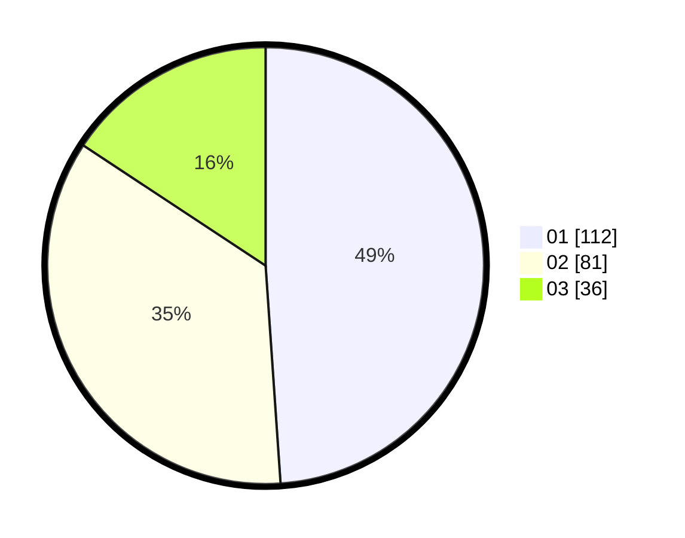

# Hasil

Hasil perolehan suara paslon dapat dilihat pada file paslon-01.txt, paslon-02.txt, dan paslon-03.txt.

Jika tidak ada, artinya data tersebut belum ada pada SIREKAP.

## Perolehan Suara

 * Paslon 01: **112**.
 * Paslon 02: **81**.
 * Paslon 03: **36**.

## Foto C Plano

https://sirekap-obj-formc.kpu.go.id/dc79/pemilu/ppwp/31/75/07/10/07/3175071007003-20240214-190059--dbfd297f-023e-48e0-9401-264ad51a583a.jpg

https://sirekap-obj-formc.kpu.go.id/dc79/pemilu/ppwp/31/75/07/10/07/3175071007003-20240214-190121--bb400d8a-2d26-4aba-863a-b079597f6d68.jpg

https://sirekap-obj-formc.kpu.go.id/dc79/pemilu/ppwp/31/75/07/10/07/3175071007003-20240214-190110--55b731e2-6b48-44dd-af1b-99f5c8e7f063.jpg

## DATA PEMILIH TETAP

Jumlah pemilih dalam DPT: **279**.
 * L: **140**.
 * P: **139**.

## DATA PENGGUNA HAK PILIH

Jumlah pengguna hak pilih dalam DPT: **224**.
 * L: **110**.
 * P: **114**.

Jumlah pengguna hak pilih dalam DPTb: **6**.
 * L: **5**.
 * P: **1**.

Jumlah pengguna hak pilih dalam DPK: **4**.
 * L: **1**.
 * P: **3**.

Jumlah pengguna hak pilih: **234**.
 * L: **116**.
 * P: **118**.

## JUMLAH SUARA SAH DAN TIDAK SAH

JUMLAH SELURUH SUARA SAH: **229**.

JUMLAH SUARA TIDAK SAH: **5**.

JUMLAH SELURUH SUARA SAH DAN SUARA TIDAK SAH: **234**.
