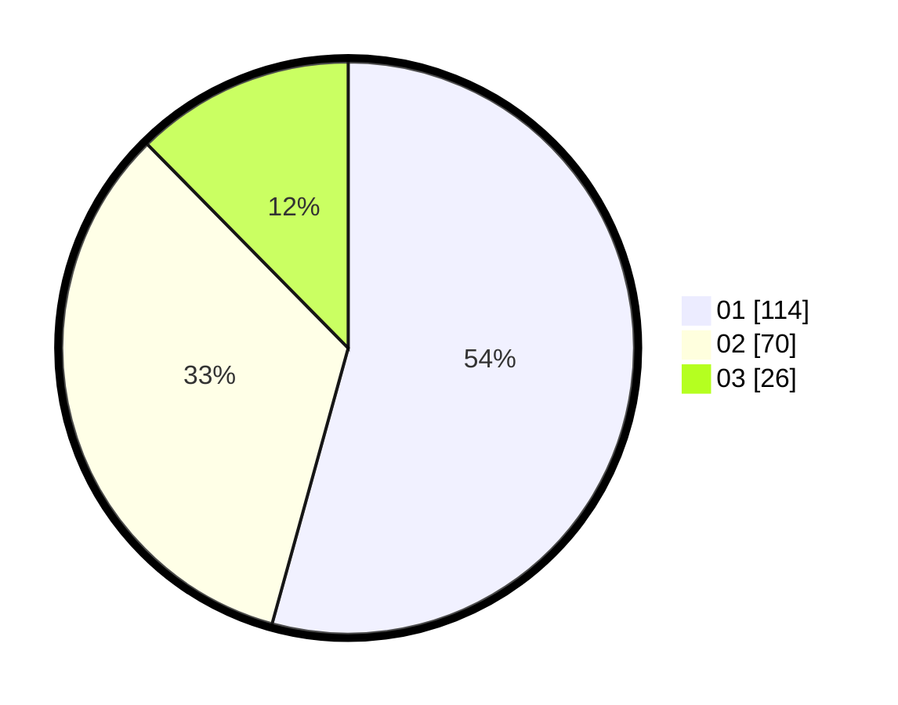

# Hasil

Hasil perolehan suara paslon dapat dilihat pada file paslon-01.txt, paslon-02.txt, dan paslon-03.txt.

Jika tidak ada, artinya data tersebut belum ada pada SIREKAP.

## Perolehan Suara

 * Paslon 01: **114**.
 * Paslon 02: **70**.
 * Paslon 03: **26**.

## Foto C Plano

https://sirekap-obj-formc.kpu.go.id/78ca/pemilu/ppwp/31/75/07/10/07/3175071007006-20240215-082741--b1733922-b15e-498a-a329-0b51c21ccaef.jpg

https://sirekap-obj-formc.kpu.go.id/78ca/pemilu/ppwp/31/75/07/10/07/3175071007006-20240215-082803--46303904-8fbd-4d50-80ce-e03b3972af00.jpg

https://sirekap-obj-formc.kpu.go.id/78ca/pemilu/ppwp/31/75/07/10/07/3175071007006-20240215-082752--382e9e03-6dae-4a30-8bf3-00596bf1ed41.jpg

## DATA PEMILIH TETAP

Jumlah pemilih dalam DPT: **275**.
 * L: **129**.
 * P: **146**.

## DATA PENGGUNA HAK PILIH

Jumlah pengguna hak pilih dalam DPT: **213**.
 * L: **91**.
 * P: **122**.

Jumlah pengguna hak pilih dalam DPTb: **2**.
 * L: **2**.
 * P: **0**.

Jumlah pengguna hak pilih dalam DPK: **0**.
 * L: **0**.
 * P: **0**.

Jumlah pengguna hak pilih: **215**.
 * L: **93**.
 * P: **122**.

## JUMLAH SUARA SAH DAN TIDAK SAH

JUMLAH SELURUH SUARA SAH: **210**.

JUMLAH SUARA TIDAK SAH: **5**.

JUMLAH SELURUH SUARA SAH DAN SUARA TIDAK SAH: **215**.
