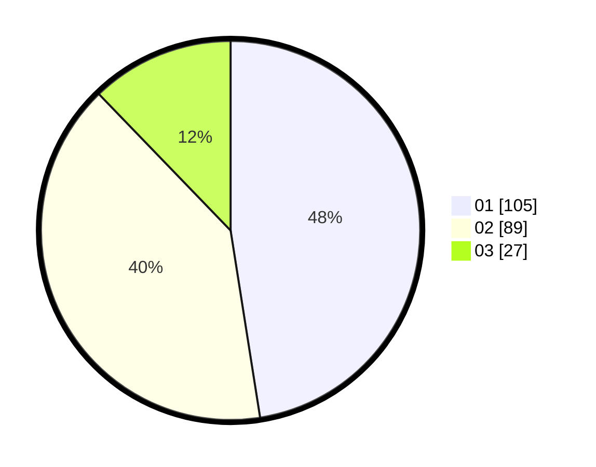

# Hasil

Hasil perolehan suara paslon dapat dilihat pada file paslon-01.txt, paslon-02.txt, dan paslon-03.txt.

Jika tidak ada, artinya data tersebut belum ada pada SIREKAP.

## Perolehan Suara

 * Paslon 01: **105**.
 * Paslon 02: **89**.
 * Paslon 03: **27**.

## Foto C Plano

https://sirekap-obj-formc.kpu.go.id/3399/pemilu/ppwp/31/75/07/10/07/3175071007007-20240216-144154--6f938884-6ba1-4952-b860-5fa5ca8322de.jpg

https://sirekap-obj-formc.kpu.go.id/3399/pemilu/ppwp/31/75/07/10/07/3175071007007-20240216-144156--414260b0-3317-4936-9b46-f04643de9d47.jpg

https://sirekap-obj-formc.kpu.go.id/3399/pemilu/ppwp/31/75/07/10/07/3175071007007-20240216-144155--78ddf90b-bc09-4424-838a-bea119feb3ae.jpg

## DATA PEMILIH TETAP

Jumlah pemilih dalam DPT: **270**.
 * L: **146**.
 * P: **124**.

## DATA PENGGUNA HAK PILIH

Jumlah pengguna hak pilih dalam DPT: **219**.
 * L: **113**.
 * P: **106**.

Jumlah pengguna hak pilih dalam DPTb: **1**.
 * L: **1**.
 * P: **0**.

Jumlah pengguna hak pilih dalam DPK: **4**.
 * L: **1**.
 * P: **3**.

Jumlah pengguna hak pilih: **224**.
 * L: **115**.
 * P: **109**.

## JUMLAH SUARA SAH DAN TIDAK SAH

JUMLAH SELURUH SUARA SAH: **221**.

JUMLAH SUARA TIDAK SAH: **3**.

JUMLAH SELURUH SUARA SAH DAN SUARA TIDAK SAH: **224**.
