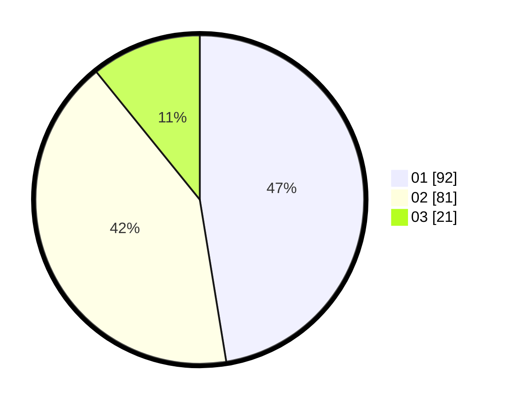

# Hasil

Hasil perolehan suara paslon dapat dilihat pada file paslon-01.txt, paslon-02.txt, dan paslon-03.txt.

Jika tidak ada, artinya data tersebut belum ada pada SIREKAP.

## Perolehan Suara

 * Paslon 01: **92**.
 * Paslon 02: **81**.
 * Paslon 03: **21**.

## Foto C Plano

https://sirekap-obj-formc.kpu.go.id/32d1/pemilu/ppwp/31/75/07/10/07/3175071007013-20240215-225038--ff5e6d88-461c-4d68-a6c4-429990961f43.jpg

https://sirekap-obj-formc.kpu.go.id/32d1/pemilu/ppwp/31/75/07/10/07/3175071007013-20240215-225039--1d9fef69-0af7-4452-95fe-aa24f440826b.jpg

https://sirekap-obj-formc.kpu.go.id/32d1/pemilu/ppwp/31/75/07/10/07/3175071007013-20240215-225039--60a06f33-b76f-43b6-8c01-f2fabc19ff66.jpg

## DATA PEMILIH TETAP

Jumlah pemilih dalam DPT: **257**.
 * L: **130**.
 * P: **127**.

## DATA PENGGUNA HAK PILIH

Jumlah pengguna hak pilih dalam DPT: **198**.
 * L: **94**.
 * P: **104**.

Jumlah pengguna hak pilih dalam DPTb: **0**.
 * L: **0**.
 * P: **0**.

Jumlah pengguna hak pilih dalam DPK: **0**.
 * L: **0**.
 * P: **0**.

Jumlah pengguna hak pilih: **198**.
 * L: **94**.
 * P: **104**.

## JUMLAH SUARA SAH DAN TIDAK SAH

JUMLAH SELURUH SUARA SAH: **194**.

JUMLAH SUARA TIDAK SAH: **4**.

JUMLAH SELURUH SUARA SAH DAN SUARA TIDAK SAH: **198**.
