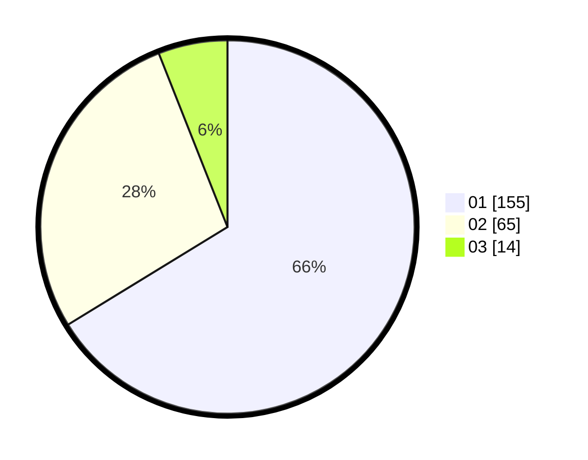

# Hasil

Hasil perolehan suara paslon dapat dilihat pada file paslon-01.txt, paslon-02.txt, dan paslon-03.txt.

Jika tidak ada, artinya data tersebut belum ada pada SIREKAP.

## Perolehan Suara

 * Paslon 01: **155**.
 * Paslon 02: **65**.
 * Paslon 03: **14**.

## Foto C Plano

https://sirekap-obj-formc.kpu.go.id/2755/pemilu/ppwp/31/75/07/10/07/3175071007020-20240218-132020--ea23c915-21a0-4ca5-b5e8-4e77f78e500c.jpg

https://sirekap-obj-formc.kpu.go.id/2755/pemilu/ppwp/31/75/07/10/07/3175071007020-20240218-132022--01b52f75-0e0c-4455-8a7a-1de76b05bfbd.jpg

https://sirekap-obj-formc.kpu.go.id/2755/pemilu/ppwp/31/75/07/10/07/3175071007020-20240218-132021--0ab5d6d7-4043-42dc-bb4b-4106a841ee5c.jpg

## DATA PEMILIH TETAP

Jumlah pemilih dalam DPT: **272**.
 * L: **145**.
 * P: **127**.

## DATA PENGGUNA HAK PILIH

Jumlah pengguna hak pilih dalam DPT: **236**.
 * L: **125**.
 * P: **111**.

Jumlah pengguna hak pilih dalam DPTb: **1**.
 * L: **1**.
 * P: **0**.

Jumlah pengguna hak pilih dalam DPK: **1**.
 * L: **0**.
 * P: **1**.

Jumlah pengguna hak pilih: **238**.
 * L: **126**.
 * P: **112**.

## JUMLAH SUARA SAH DAN TIDAK SAH

JUMLAH SELURUH SUARA SAH: **234**.

JUMLAH SUARA TIDAK SAH: **4**.

JUMLAH SELURUH SUARA SAH DAN SUARA TIDAK SAH: **238**.
