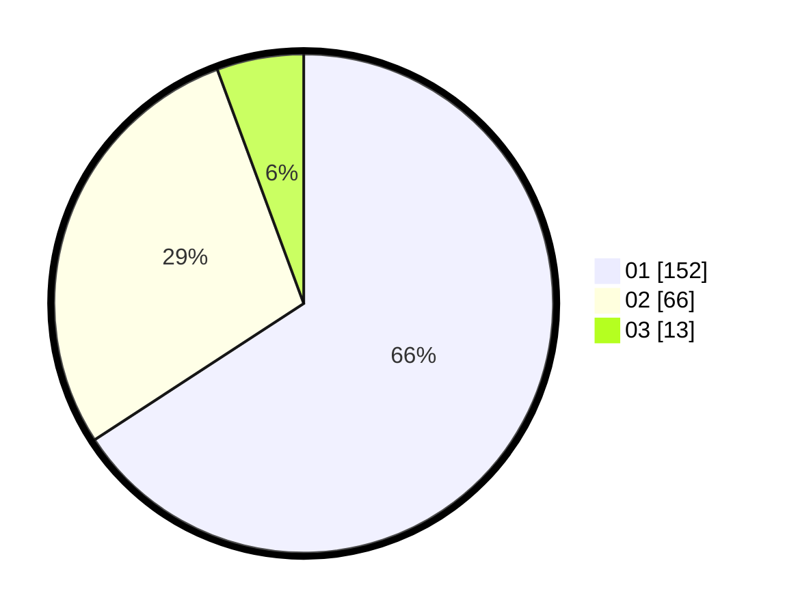

# Hasil

Hasil perolehan suara paslon dapat dilihat pada file paslon-01.txt, paslon-02.txt, dan paslon-03.txt.

Jika tidak ada, artinya data tersebut belum ada pada SIREKAP.

## Perolehan Suara

 * Paslon 01: **152**.
 * Paslon 02: **66**.
 * Paslon 03: **13**.

## Foto C Plano

https://sirekap-obj-formc.kpu.go.id/af0c/pemilu/ppwp/31/75/07/10/07/3175071007021-20240216-105640--4dc8570b-a7d8-42f4-811e-a01f5e67577f.jpg

https://sirekap-obj-formc.kpu.go.id/af0c/pemilu/ppwp/31/75/07/10/07/3175071007021-20240216-105643--05b0f91b-0429-475f-8e54-9ebd6040c601.jpg

https://sirekap-obj-formc.kpu.go.id/af0c/pemilu/ppwp/31/75/07/10/07/3175071007021-20240216-105641--9c7ae455-df29-428d-8ba7-7553da2b117e.jpg

## DATA PEMILIH TETAP

Jumlah pemilih dalam DPT: **271**.
 * L: **142**.
 * P: **129**.

## DATA PENGGUNA HAK PILIH

Jumlah pengguna hak pilih dalam DPT: **236**.
 * L: **120**.
 * P: **116**.

Jumlah pengguna hak pilih dalam DPTb: **0**.
 * L: **0**.
 * P: **0**.

Jumlah pengguna hak pilih dalam DPK: **3**.
 * L: **0**.
 * P: **3**.

Jumlah pengguna hak pilih: **239**.
 * L: **120**.
 * P: **119**.

## JUMLAH SUARA SAH DAN TIDAK SAH

JUMLAH SELURUH SUARA SAH: **231**.

JUMLAH SUARA TIDAK SAH: **8**.

JUMLAH SELURUH SUARA SAH DAN SUARA TIDAK SAH: **239**.
