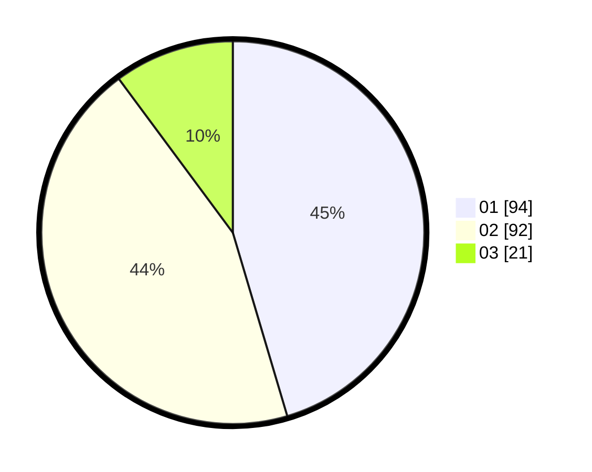

# Hasil

Hasil perolehan suara paslon dapat dilihat pada file paslon-01.txt, paslon-02.txt, dan paslon-03.txt.

Jika tidak ada, artinya data tersebut belum ada pada SIREKAP.

## Perolehan Suara

 * Paslon 01: **94**.
 * Paslon 02: **92**.
 * Paslon 03: **21**.

## Foto C Plano

https://sirekap-obj-formc.kpu.go.id/947e/pemilu/ppwp/31/75/07/10/07/3175071007022-20240218-091636--a3c852b3-ca77-4c53-93b6-f041a8d6a388.jpg

https://sirekap-obj-formc.kpu.go.id/947e/pemilu/ppwp/31/75/07/10/07/3175071007022-20240218-091637--88ce401d-303f-4929-b4da-30f5da69fdf8.jpg

https://sirekap-obj-formc.kpu.go.id/947e/pemilu/ppwp/31/75/07/10/07/3175071007022-20240218-091636--2d8e57da-e3f5-450a-b832-e1b320e22564.jpg

## DATA PEMILIH TETAP

Jumlah pemilih dalam DPT: **274**.
 * L: **134**.
 * P: **140**.

## DATA PENGGUNA HAK PILIH

Jumlah pengguna hak pilih dalam DPT: **206**.
 * L: **96**.
 * P: **110**.

Jumlah pengguna hak pilih dalam DPTb: **0**.
 * L: **0**.
 * P: **0**.

Jumlah pengguna hak pilih dalam DPK: **1**.
 * L: **1**.
 * P: **0**.

Jumlah pengguna hak pilih: **207**.
 * L: **97**.
 * P: **110**.

## JUMLAH SUARA SAH DAN TIDAK SAH

JUMLAH SELURUH SUARA SAH: **207**.

JUMLAH SUARA TIDAK SAH: **0**.

JUMLAH SELURUH SUARA SAH DAN SUARA TIDAK SAH: **207**.
