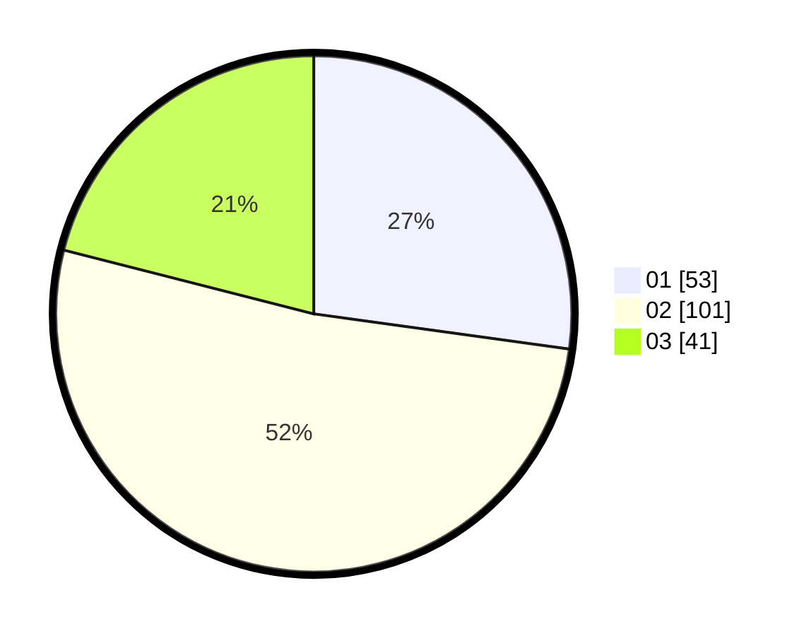

# Hasil

Hasil perolehan suara paslon dapat dilihat pada file paslon-01.txt, paslon-02.txt, dan paslon-03.txt.

Jika tidak ada, artinya data tersebut belum ada pada SIREKAP.

## Perolehan Suara

 * Paslon 01: **53**.
 * Paslon 02: **101**.
 * Paslon 03: **41**.

## Foto C Plano

https://sirekap-obj-formc.kpu.go.id/6b65/pemilu/ppwp/31/75/07/10/07/3175071007034-20240214-224339--c52eeea1-3cba-4bd6-84e2-3c4f1e82eb16.jpg

https://sirekap-obj-formc.kpu.go.id/6b65/pemilu/ppwp/31/75/07/10/07/3175071007034-20240214-224607--00b515b4-b99b-4040-a1ee-f1f88e364921.jpg

https://sirekap-obj-formc.kpu.go.id/6b65/pemilu/ppwp/31/75/07/10/07/3175071007034-20240214-224758--59b77a67-d93b-4a7f-a727-34a9e51c18ca.jpg
