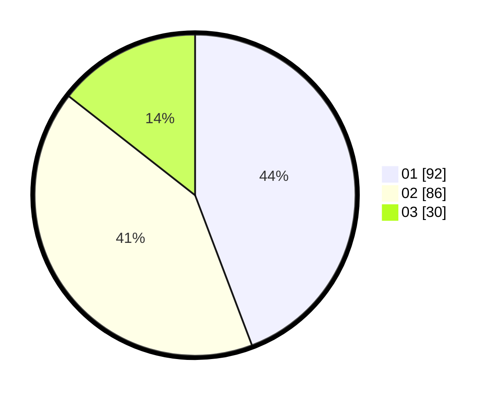

# Hasil

Hasil perolehan suara paslon dapat dilihat pada file paslon-01.txt, paslon-02.txt, dan paslon-03.txt.

Jika tidak ada, artinya data tersebut belum ada pada SIREKAP.

## Perolehan Suara

 * Paslon 01: **92**.
 * Paslon 02: **86**.
 * Paslon 03: **30**.

## Foto C Plano

https://sirekap-obj-formc.kpu.go.id/ebc2/pemilu/ppwp/31/75/07/10/07/3175071007038-20240216-024220--e985a3f5-fdd2-42db-b2f0-c6ace3388317.jpg

https://sirekap-obj-formc.kpu.go.id/ebc2/pemilu/ppwp/31/75/07/10/07/3175071007038-20240216-024230--ccc82f16-d446-412e-a2d5-ccd9019ddc22.jpg

https://sirekap-obj-formc.kpu.go.id/ebc2/pemilu/ppwp/31/75/07/10/07/3175071007038-20240216-024223--52715a67-83ac-4cfe-a79c-77acc3a0f999.jpg

## DATA PEMILIH TETAP

Jumlah pemilih dalam DPT: **262**.
 * L: **142**.
 * P: **120**.

## DATA PENGGUNA HAK PILIH

Jumlah pengguna hak pilih dalam DPT: **209**.
 * L: **112**.
 * P: **97**.

Jumlah pengguna hak pilih dalam DPTb: **0**.
 * L: **0**.
 * P: **0**.

Jumlah pengguna hak pilih dalam DPK: **0**.
 * L: **1**.
 * P: **0**.

Jumlah pengguna hak pilih: **210**.
 * L: **113**.
 * P: **97**.

## JUMLAH SUARA SAH DAN TIDAK SAH

JUMLAH SELURUH SUARA SAH: **208**.

JUMLAH SUARA TIDAK SAH: **2**.

JUMLAH SELURUH SUARA SAH DAN SUARA TIDAK SAH: **210**.
