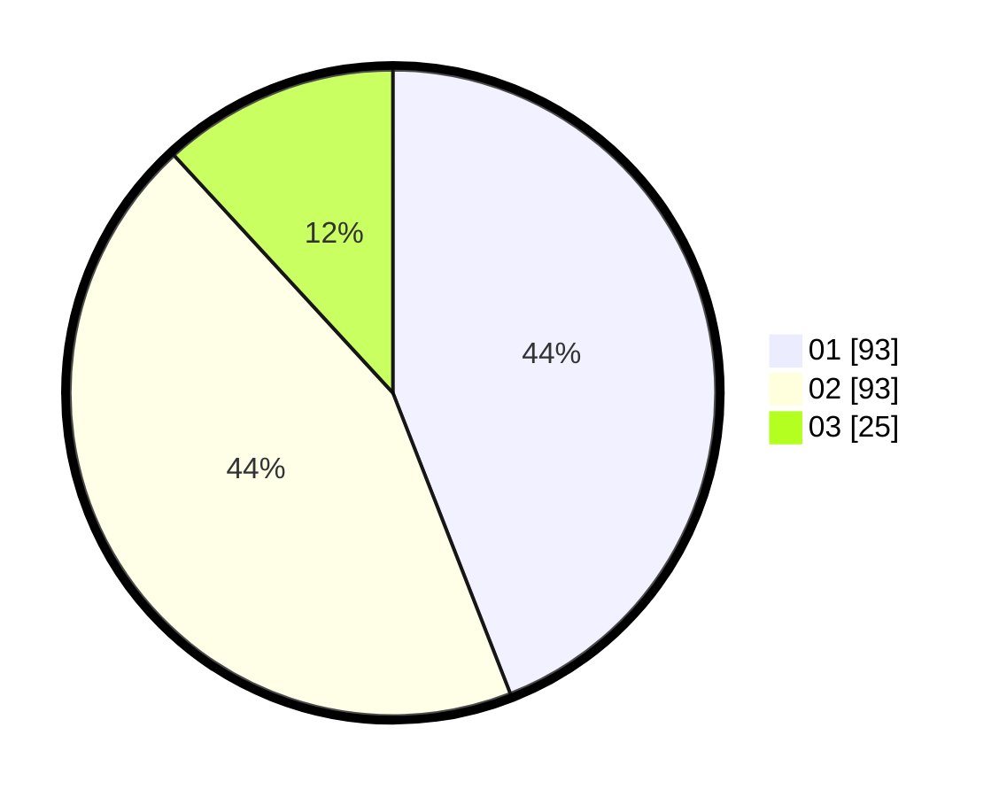

# Hasil

Hasil perolehan suara paslon dapat dilihat pada file paslon-01.txt, paslon-02.txt, dan paslon-03.txt.

Jika tidak ada, artinya data tersebut belum ada pada SIREKAP.

## Perolehan Suara

 * Paslon 01: **93**.
 * Paslon 02: **93**.
 * Paslon 03: **25**.

## Foto C Plano

https://sirekap-obj-formc.kpu.go.id/0a19/pemilu/ppwp/31/75/07/10/07/3175071007039-20240215-213422--058dc7b0-3c3a-4282-82e1-2e1372c7d811.jpg

https://sirekap-obj-formc.kpu.go.id/0a19/pemilu/ppwp/31/75/07/10/07/3175071007039-20240215-213426--4539d730-11b4-48ed-ab50-f79cecb28d09.jpg

https://sirekap-obj-formc.kpu.go.id/0a19/pemilu/ppwp/31/75/07/10/07/3175071007039-20240215-213424--3a21b8b1-0077-41a5-ab9e-712fd364c993.jpg

## DATA PEMILIH TETAP

Jumlah pemilih dalam DPT: **261**.
 * L: **140**.
 * P: **121**.

## DATA PENGGUNA HAK PILIH

Jumlah pengguna hak pilih dalam DPT: **213**.
 * L: **109**.
 * P: **104**.

Jumlah pengguna hak pilih dalam DPTb: **0**.
 * L: **0**.
 * P: **0**.

Jumlah pengguna hak pilih dalam DPK: **0**.
 * L: **0**.
 * P: **0**.

Jumlah pengguna hak pilih: **213**.
 * L: **109**.
 * P: **104**.

## JUMLAH SUARA SAH DAN TIDAK SAH

JUMLAH SELURUH SUARA SAH: **211**.

JUMLAH SUARA TIDAK SAH: **2**.

JUMLAH SELURUH SUARA SAH DAN SUARA TIDAK SAH: **213**.
