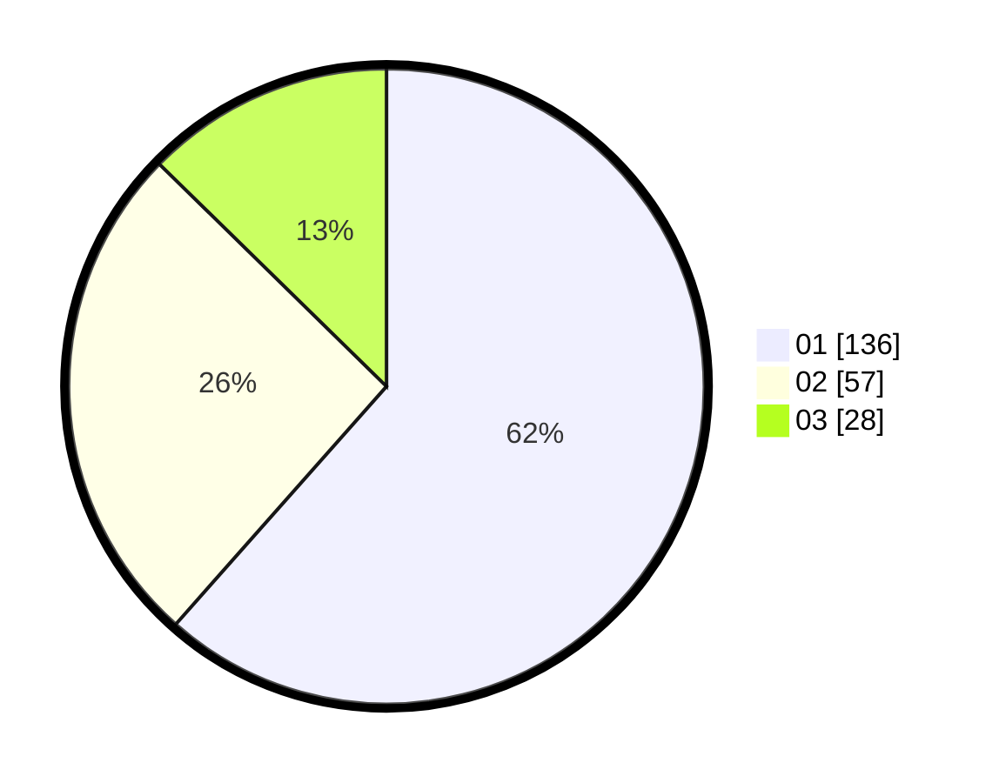

# Hasil

Hasil perolehan suara paslon dapat dilihat pada file paslon-01.txt, paslon-02.txt, dan paslon-03.txt.

Jika tidak ada, artinya data tersebut belum ada pada SIREKAP.

## Perolehan Suara

 * Paslon 01: **136**.
 * Paslon 02: **57**.
 * Paslon 03: **28**.

## Foto C Plano

https://sirekap-obj-formc.kpu.go.id/25fe/pemilu/ppwp/31/75/07/10/07/3175071007044-20240214-141420--b9f88857-bf1f-4e5b-b29b-11f9b05d59d5.jpg

https://sirekap-obj-formc.kpu.go.id/25fe/pemilu/ppwp/31/75/07/10/07/3175071007044-20240214-141208--3af6f6b9-2e82-4a1f-951d-f58c172330e7.jpg

https://sirekap-obj-formc.kpu.go.id/25fe/pemilu/ppwp/31/75/07/10/07/3175071007044-20240216-034141--efbbdb38-c95b-4fc2-aa28-cc0d5ad08b64.jpg

## DATA PEMILIH TETAP

Jumlah pemilih dalam DPT: **262**.
 * L: **128**.
 * P: **134**.

## DATA PENGGUNA HAK PILIH

Jumlah pengguna hak pilih dalam DPT: **225**.
 * L: **108**.
 * P: **117**.

Jumlah pengguna hak pilih dalam DPTb: **0**.
 * L: **0**.
 * P: **0**.

Jumlah pengguna hak pilih dalam DPK: **3**.
 * L: **2**.
 * P: **1**.

Jumlah pengguna hak pilih: **228**.
 * L: **110**.
 * P: **118**.

## JUMLAH SUARA SAH DAN TIDAK SAH

JUMLAH SELURUH SUARA SAH: **221**.

JUMLAH SUARA TIDAK SAH: **7**.

JUMLAH SELURUH SUARA SAH DAN SUARA TIDAK SAH: **228**.
