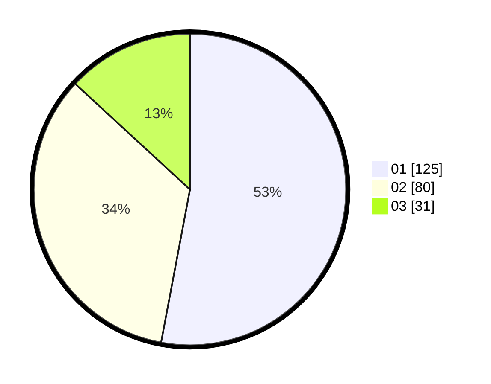

# Hasil

Hasil perolehan suara paslon dapat dilihat pada file paslon-01.txt, paslon-02.txt, dan paslon-03.txt.

Jika tidak ada, artinya data tersebut belum ada pada SIREKAP.

## Perolehan Suara

 * Paslon 01: **125**.
 * Paslon 02: **80**.
 * Paslon 03: **31**.

## Foto C Plano

https://sirekap-obj-formc.kpu.go.id/d0f1/pemilu/ppwp/31/75/07/10/07/3175071007046-20240215-004610--b005a059-20a8-4ea6-9bf1-c613001aae87.jpg

https://sirekap-obj-formc.kpu.go.id/d0f1/pemilu/ppwp/31/75/07/10/07/3175071007046-20240215-004631--80d6c38e-3f90-471e-b4b4-cefc9f5c5906.jpg

https://sirekap-obj-formc.kpu.go.id/d0f1/pemilu/ppwp/31/75/07/10/07/3175071007046-20240215-004620--e6d94f19-436c-4388-ae15-e38958b30ec5.jpg

## DATA PEMILIH TETAP

Jumlah pemilih dalam DPT: **261**.
 * L: **130**.
 * P: **131**.

## DATA PENGGUNA HAK PILIH

Jumlah pengguna hak pilih dalam DPT: **235**.
 * L: **114**.
 * P: **121**.

Jumlah pengguna hak pilih dalam DPTb: **0**.
 * L: **0**.
 * P: **0**.

Jumlah pengguna hak pilih dalam DPK: **5**.
 * L: **3**.
 * P: **2**.

Jumlah pengguna hak pilih: **240**.
 * L: **117**.
 * P: **123**.

## JUMLAH SUARA SAH DAN TIDAK SAH

JUMLAH SELURUH SUARA SAH: **236**.

JUMLAH SUARA TIDAK SAH: **4**.

JUMLAH SELURUH SUARA SAH DAN SUARA TIDAK SAH: **240**.
