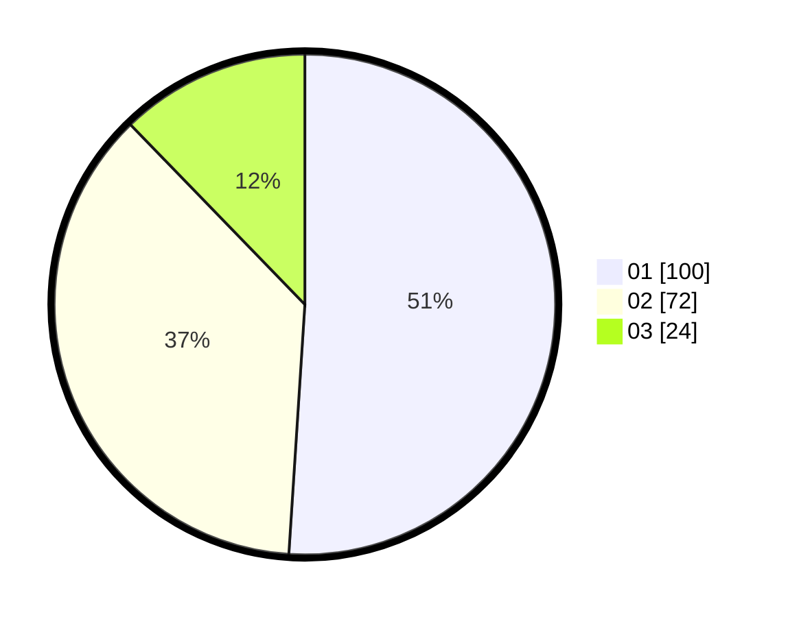

# Hasil

Hasil perolehan suara paslon dapat dilihat pada file paslon-01.txt, paslon-02.txt, dan paslon-03.txt.

Jika tidak ada, artinya data tersebut belum ada pada SIREKAP.

## Perolehan Suara

 * Paslon 01: **100**.
 * Paslon 02: **72**.
 * Paslon 03: **24**.

## Foto C Plano

https://sirekap-obj-formc.kpu.go.id/16dc/pemilu/ppwp/31/75/07/10/07/3175071007049-20240216-140832--4d0c15ab-e18c-4121-a9eb-49daed07dfb5.jpg

https://sirekap-obj-formc.kpu.go.id/16dc/pemilu/ppwp/31/75/07/10/07/3175071007049-20240216-140833--ebe1f8ee-37eb-41b9-a07b-f0ba3b411306.jpg

https://sirekap-obj-formc.kpu.go.id/16dc/pemilu/ppwp/31/75/07/10/07/3175071007049-20240216-140832--db8d191a-4aeb-4d6c-a206-51cd832b90cc.jpg

## DATA PEMILIH TETAP

Jumlah pemilih dalam DPT: **258**.
 * L: **125**.
 * P: **133**.

## DATA PENGGUNA HAK PILIH

Jumlah pengguna hak pilih dalam DPT: **197**.
 * L: **94**.
 * P: **103**.

Jumlah pengguna hak pilih dalam DPTb: **1**.
 * L: **1**.
 * P: **0**.

Jumlah pengguna hak pilih dalam DPK: **0**.
 * L: **0**.
 * P: **0**.

Jumlah pengguna hak pilih: **198**.
 * L: **95**.
 * P: **103**.

## JUMLAH SUARA SAH DAN TIDAK SAH

JUMLAH SELURUH SUARA SAH: **196**.

JUMLAH SUARA TIDAK SAH: **3**.

JUMLAH SELURUH SUARA SAH DAN SUARA TIDAK SAH: **199**.
