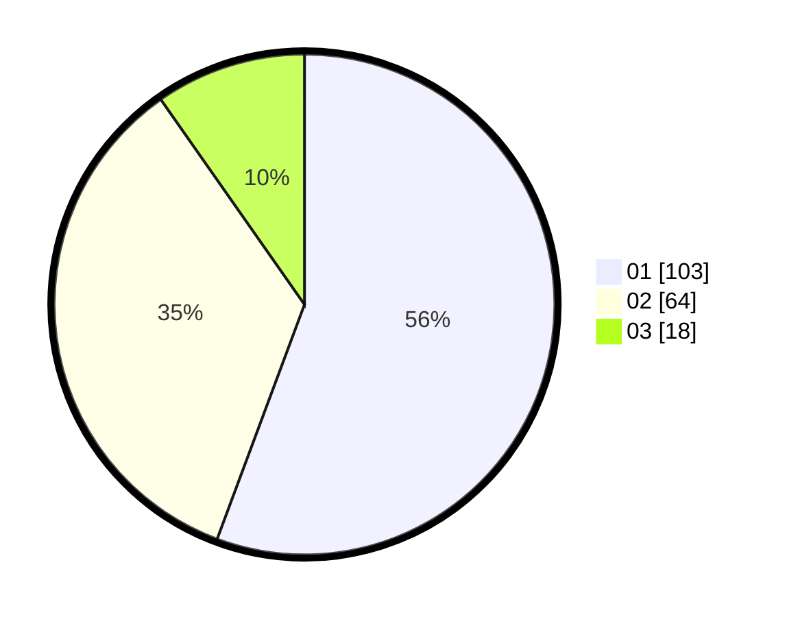

# Hasil

Hasil perolehan suara paslon dapat dilihat pada file paslon-01.txt, paslon-02.txt, dan paslon-03.txt.

Jika tidak ada, artinya data tersebut belum ada pada SIREKAP.

## Perolehan Suara

 * Paslon 01: **103**.
 * Paslon 02: **64**.
 * Paslon 03: **18**.

## Foto C Plano

https://sirekap-obj-formc.kpu.go.id/7973/pemilu/ppwp/31/75/07/10/07/3175071007061-20240216-074237--64e7ce02-a8c2-4e42-aa72-2616f4fe3759.jpg

https://sirekap-obj-formc.kpu.go.id/7973/pemilu/ppwp/31/75/07/10/07/3175071007061-20240216-074251--47d52778-0662-4e3f-8a65-f4ef1f104074.jpg

https://sirekap-obj-formc.kpu.go.id/7973/pemilu/ppwp/31/75/07/10/07/3175071007061-20240216-074246--368def24-ef21-422d-8b37-d8ce78ff570e.jpg

## DATA PEMILIH TETAP

Jumlah pemilih dalam DPT: **225**.
 * L: **125**.
 * P: **100**.

## DATA PENGGUNA HAK PILIH

Jumlah pengguna hak pilih dalam DPT: **185**.
 * L: **106**.
 * P: **79**.

Jumlah pengguna hak pilih dalam DPTb: **1**.
 * L: **1**.
 * P: **0**.

Jumlah pengguna hak pilih dalam DPK: **3**.
 * L: **2**.
 * P: **1**.

Jumlah pengguna hak pilih: **189**.
 * L: **109**.
 * P: **80**.

## JUMLAH SUARA SAH DAN TIDAK SAH

JUMLAH SELURUH SUARA SAH: **185**.

JUMLAH SUARA TIDAK SAH: **4**.

JUMLAH SELURUH SUARA SAH DAN SUARA TIDAK SAH: **189**.
