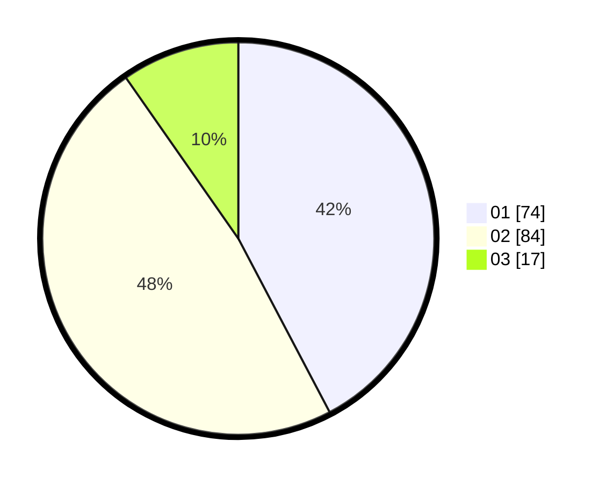

# Hasil

Hasil perolehan suara paslon dapat dilihat pada file paslon-01.txt, paslon-02.txt, dan paslon-03.txt.

Jika tidak ada, artinya data tersebut belum ada pada SIREKAP.

## Perolehan Suara

 * Paslon 01: **74**.
 * Paslon 02: **84**.
 * Paslon 03: **17**.

## Foto C Plano

https://sirekap-obj-formc.kpu.go.id/ce08/pemilu/ppwp/31/75/07/10/07/3175071007062-20240216-135500--3df0b8e2-028a-4703-b5c0-676faf5adc71.jpg

https://sirekap-obj-formc.kpu.go.id/ce08/pemilu/ppwp/31/75/07/10/07/3175071007062-20240216-135501--32862856-d93e-4663-aaab-49e4d9400163.jpg

https://sirekap-obj-formc.kpu.go.id/ce08/pemilu/ppwp/31/75/07/10/07/3175071007062-20240216-135501--0a8300b6-9e03-445b-8c77-da0ac3044dd1.jpg

## DATA PEMILIH TETAP

Jumlah pemilih dalam DPT: **222**.
 * L: **110**.
 * P: **112**.

## DATA PENGGUNA HAK PILIH

Jumlah pengguna hak pilih dalam DPT: **177**.
 * L: **88**.
 * P: **89**.

Jumlah pengguna hak pilih dalam DPTb: **0**.
 * L: **0**.
 * P: **0**.

Jumlah pengguna hak pilih dalam DPK: **0**.
 * L: **0**.
 * P: **0**.

Jumlah pengguna hak pilih: **177**.
 * L: **88**.
 * P: **89**.

## JUMLAH SUARA SAH DAN TIDAK SAH

JUMLAH SELURUH SUARA SAH: **175**.

JUMLAH SUARA TIDAK SAH: **2**.

JUMLAH SELURUH SUARA SAH DAN SUARA TIDAK SAH: **177**.
