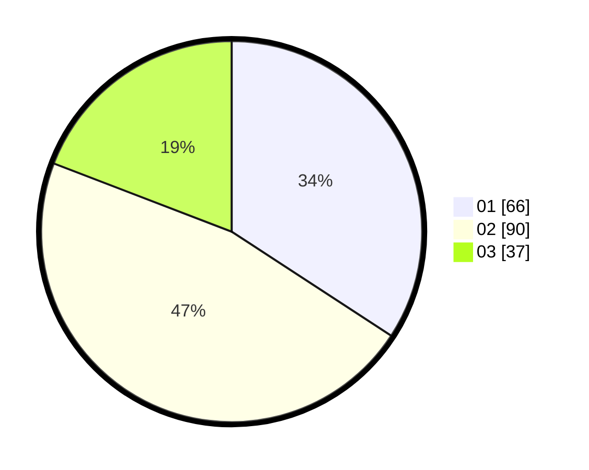

# Hasil

Hasil perolehan suara paslon dapat dilihat pada file paslon-01.txt, paslon-02.txt, dan paslon-03.txt.

Jika tidak ada, artinya data tersebut belum ada pada SIREKAP.

## Perolehan Suara

 * Paslon 01: **66**.
 * Paslon 02: **90**.
 * Paslon 03: **37**.

## Foto C Plano

https://sirekap-obj-formc.kpu.go.id/42b0/pemilu/ppwp/31/75/07/10/07/3175071007066-20240216-134314--c878fb9a-d926-4fa2-b3a1-164b5e87abde.jpg

https://sirekap-obj-formc.kpu.go.id/42b0/pemilu/ppwp/31/75/07/10/07/3175071007066-20240216-134315--5c938284-96c5-43cf-b919-2b6b06280db0.jpg

https://sirekap-obj-formc.kpu.go.id/42b0/pemilu/ppwp/31/75/07/10/07/3175071007066-20240216-134314--90a4045e-3010-4249-960e-159631e062b1.jpg

## DATA PEMILIH TETAP

Jumlah pemilih dalam DPT: **248**.
 * L: **129**.
 * P: **119**.

## DATA PENGGUNA HAK PILIH

Jumlah pengguna hak pilih dalam DPT: **192**.
 * L: **96**.
 * P: **96**.

Jumlah pengguna hak pilih dalam DPTb: **0**.
 * L: **0**.
 * P: **0**.

Jumlah pengguna hak pilih dalam DPK: **2**.
 * L: **2**.
 * P: **0**.

Jumlah pengguna hak pilih: **194**.
 * L: **98**.
 * P: **96**.

## JUMLAH SUARA SAH DAN TIDAK SAH

JUMLAH SELURUH SUARA SAH: **193**.

JUMLAH SUARA TIDAK SAH: **1**.

JUMLAH SELURUH SUARA SAH DAN SUARA TIDAK SAH: **194**.
