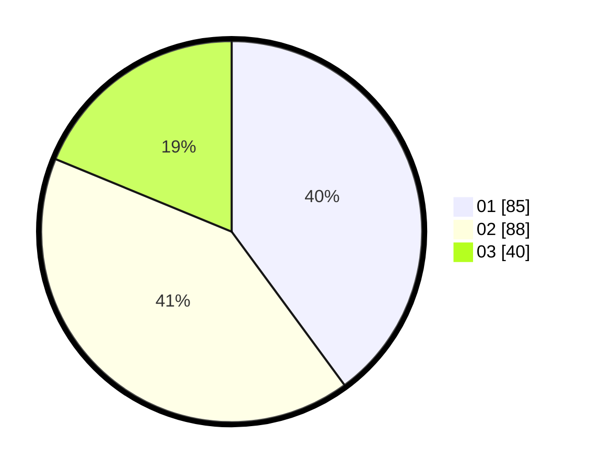

# Hasil

Hasil perolehan suara paslon dapat dilihat pada file paslon-01.txt, paslon-02.txt, dan paslon-03.txt.

Jika tidak ada, artinya data tersebut belum ada pada SIREKAP.

## Perolehan Suara

 * Paslon 01: **85**.
 * Paslon 02: **88**.
 * Paslon 03: **40**.

## Foto C Plano

https://sirekap-obj-formc.kpu.go.id/718a/pemilu/ppwp/31/75/07/10/07/3175071007067-20240215-123524--1728086a-7874-4f91-a299-961a34b71493.jpg

https://sirekap-obj-formc.kpu.go.id/718a/pemilu/ppwp/31/75/07/10/07/3175071007067-20240215-123545--0ff43ace-f62b-48ba-82cc-eaec49c05eed.jpg

https://sirekap-obj-formc.kpu.go.id/718a/pemilu/ppwp/31/75/07/10/07/3175071007067-20240215-123535--3cf27dc7-c550-42a9-85dd-bb43cb8bdacf.jpg

## DATA PEMILIH TETAP

Jumlah pemilih dalam DPT: **245**.
 * L: **127**.
 * P: **118**.

## DATA PENGGUNA HAK PILIH

Jumlah pengguna hak pilih dalam DPT: **216**.
 * L: **116**.
 * P: **100**.

Jumlah pengguna hak pilih dalam DPTb: **2**.
 * L: **1**.
 * P: **1**.

Jumlah pengguna hak pilih dalam DPK: **0**.
 * L: **0**.
 * P: **0**.

Jumlah pengguna hak pilih: **218**.
 * L: **117**.
 * P: **101**.

## JUMLAH SUARA SAH DAN TIDAK SAH

JUMLAH SELURUH SUARA SAH: **213**.

JUMLAH SUARA TIDAK SAH: **5**.

JUMLAH SELURUH SUARA SAH DAN SUARA TIDAK SAH: **218**.
