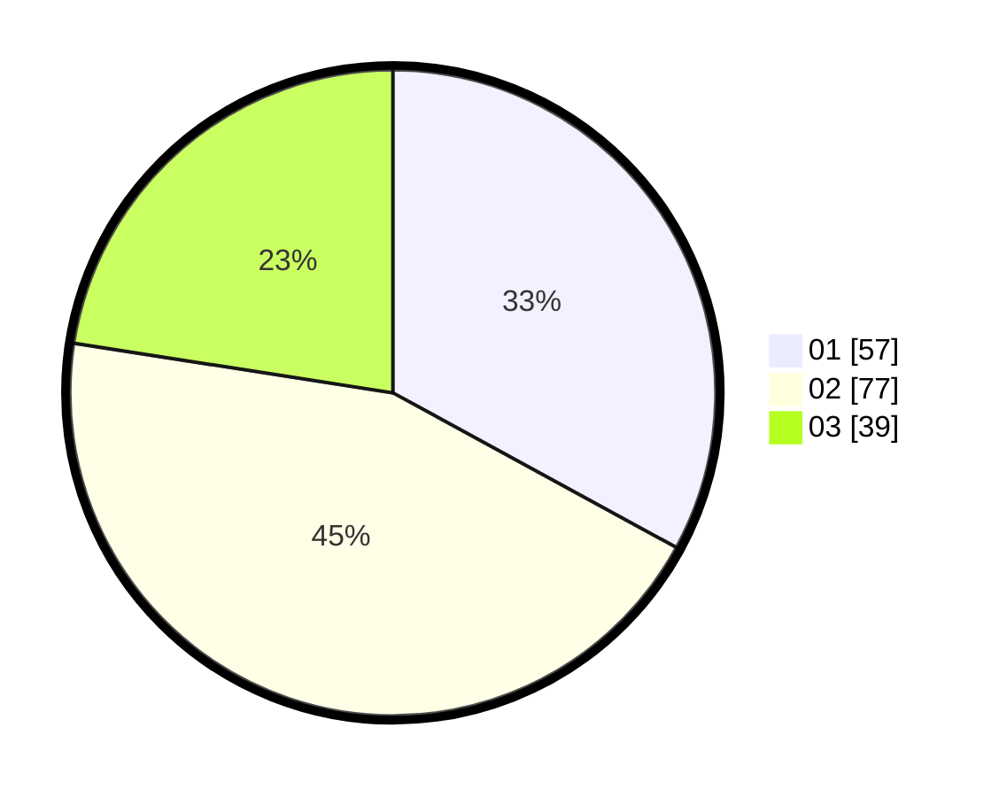

# Hasil

Hasil perolehan suara paslon dapat dilihat pada file paslon-01.txt, paslon-02.txt, dan paslon-03.txt.

Jika tidak ada, artinya data tersebut belum ada pada SIREKAP.

## Perolehan Suara

 * Paslon 01: **57**.
 * Paslon 02: **77**.
 * Paslon 03: **39**.

## Foto C Plano

https://sirekap-obj-formc.kpu.go.id/9b18/pemilu/ppwp/31/75/07/10/07/3175071007068-20240215-042553--2e6282fe-d403-4ff3-b16b-a5717ef07bd3.jpg

https://sirekap-obj-formc.kpu.go.id/9b18/pemilu/ppwp/31/75/07/10/07/3175071007068-20240215-042614--93dcbe2d-6bb1-4b52-be69-54f14d23a4a5.jpg

https://sirekap-obj-formc.kpu.go.id/9b18/pemilu/ppwp/31/75/07/10/07/3175071007068-20240215-042603--f8e6d55e-8bb5-469e-9542-dd316fb90895.jpg

## DATA PEMILIH TETAP

Jumlah pemilih dalam DPT: **218**.
 * L: **119**.
 * P: **99**.

## DATA PENGGUNA HAK PILIH

Jumlah pengguna hak pilih dalam DPT: **175**.
 * L: **88**.
 * P: **87**.

Jumlah pengguna hak pilih dalam DPTb: **0**.
 * L: **0**.
 * P: **0**.

Jumlah pengguna hak pilih dalam DPK: **0**.
 * L: **0**.
 * P: **0**.

Jumlah pengguna hak pilih: **175**.
 * L: **88**.
 * P: **87**.

## JUMLAH SUARA SAH DAN TIDAK SAH

JUMLAH SELURUH SUARA SAH: **173**.

JUMLAH SUARA TIDAK SAH: **2**.

JUMLAH SELURUH SUARA SAH DAN SUARA TIDAK SAH: **175**.
