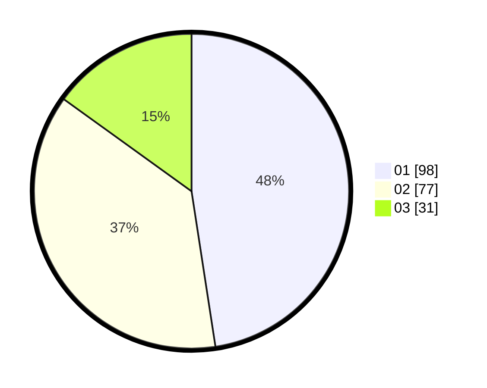

# Hasil

Hasil perolehan suara paslon dapat dilihat pada file paslon-01.txt, paslon-02.txt, dan paslon-03.txt.

Jika tidak ada, artinya data tersebut belum ada pada SIREKAP.

## Perolehan Suara

 * Paslon 01: **98**.
 * Paslon 02: **77**.
 * Paslon 03: **31**.

## Foto C Plano

https://sirekap-obj-formc.kpu.go.id/9fd7/pemilu/ppwp/31/75/07/10/07/3175071007076-20240216-152429--032320ca-a4ec-47f6-acfd-2b4857962232.jpg

https://sirekap-obj-formc.kpu.go.id/9fd7/pemilu/ppwp/31/75/07/10/07/3175071007076-20240216-152430--0760422c-262b-4a44-a0c2-0cb3700234cc.jpg

https://sirekap-obj-formc.kpu.go.id/9fd7/pemilu/ppwp/31/75/07/10/07/3175071007076-20240216-152430--46c1c166-9f4b-4222-96bf-9c6713b27314.jpg

## DATA PEMILIH TETAP

Jumlah pemilih dalam DPT: **251**.
 * L: **125**.
 * P: **126**.

## DATA PENGGUNA HAK PILIH

Jumlah pengguna hak pilih dalam DPT: **206**.
 * L: **99**.
 * P: **107**.

Jumlah pengguna hak pilih dalam DPTb: **1**.
 * L: **0**.
 * P: **1**.

Jumlah pengguna hak pilih dalam DPK: **1**.
 * L: **1**.
 * P: **0**.

Jumlah pengguna hak pilih: **208**.
 * L: **100**.
 * P: **108**.

## JUMLAH SUARA SAH DAN TIDAK SAH

JUMLAH SELURUH SUARA SAH: **206**.

JUMLAH SUARA TIDAK SAH: **2**.

JUMLAH SELURUH SUARA SAH DAN SUARA TIDAK SAH: **208**.
