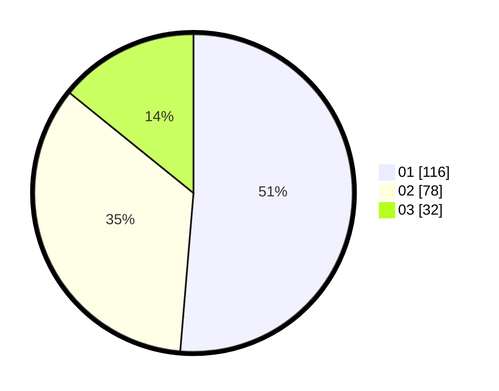

# Hasil

Hasil perolehan suara paslon dapat dilihat pada file paslon-01.txt, paslon-02.txt, dan paslon-03.txt.

Jika tidak ada, artinya data tersebut belum ada pada SIREKAP.

## Perolehan Suara

 * Paslon 01: **116**.
 * Paslon 02: **78**.
 * Paslon 03: **32**.

## Foto C Plano

https://sirekap-obj-formc.kpu.go.id/c10b/pemilu/ppwp/31/75/07/10/07/3175071007078-20240215-112903--a77e9274-ac12-40cc-8369-bf7fd42a16d7.jpg

https://sirekap-obj-formc.kpu.go.id/c10b/pemilu/ppwp/31/75/07/10/07/3175071007078-20240215-112931--593fcfd0-c16e-4af8-ae32-93fd65fa1ed2.jpg

https://sirekap-obj-formc.kpu.go.id/c10b/pemilu/ppwp/31/75/07/10/07/3175071007078-20240215-112914--070a348f-5684-43b7-978b-6323d6ebef03.jpg

## DATA PEMILIH TETAP

Jumlah pemilih dalam DPT: **249**.
 * L: **122**.
 * P: **127**.

## DATA PENGGUNA HAK PILIH

Jumlah pengguna hak pilih dalam DPT: **222**.
 * L: **106**.
 * P: **116**.

Jumlah pengguna hak pilih dalam DPTb: **0**.
 * L: **0**.
 * P: **0**.

Jumlah pengguna hak pilih dalam DPK: **6**.
 * L: **5**.
 * P: **1**.

Jumlah pengguna hak pilih: **228**.
 * L: **111**.
 * P: **117**.

## JUMLAH SUARA SAH DAN TIDAK SAH

JUMLAH SELURUH SUARA SAH: **226**.

JUMLAH SUARA TIDAK SAH: **2**.

JUMLAH SELURUH SUARA SAH DAN SUARA TIDAK SAH: **228**.
