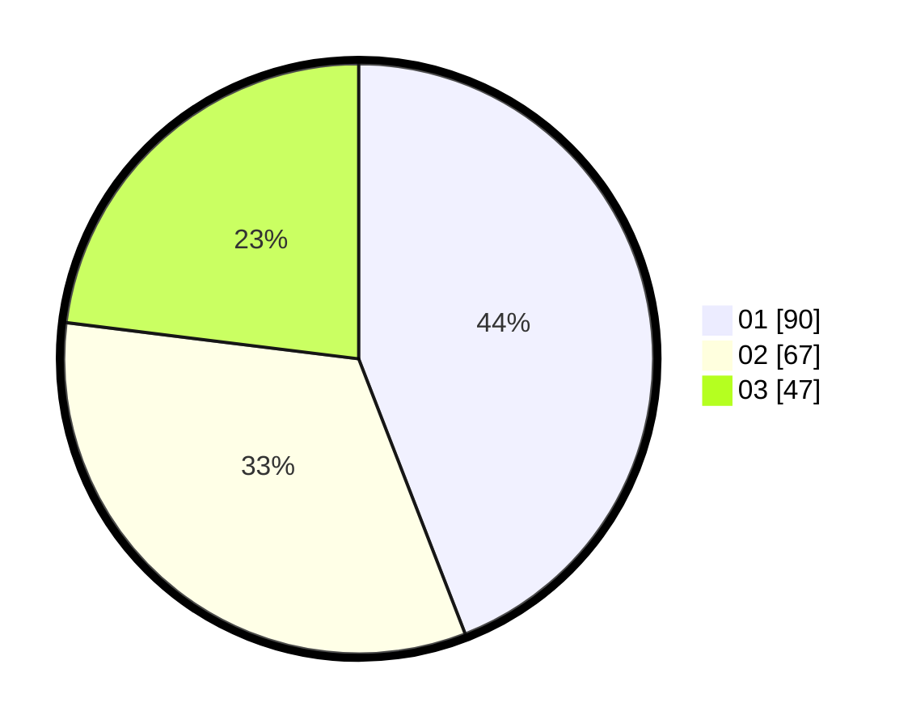

# Hasil

Hasil perolehan suara paslon dapat dilihat pada file paslon-01.txt, paslon-02.txt, dan paslon-03.txt.

Jika tidak ada, artinya data tersebut belum ada pada SIREKAP.

## Perolehan Suara

 * Paslon 01: **90**.
 * Paslon 02: **67**.
 * Paslon 03: **47**.

## Foto C Plano

https://sirekap-obj-formc.kpu.go.id/b4ea/pemilu/ppwp/31/75/07/10/07/3175071007081-20240216-041308--9736aaf4-4279-45e9-a593-fafe385e6592.jpg

https://sirekap-obj-formc.kpu.go.id/b4ea/pemilu/ppwp/31/75/07/10/07/3175071007081-20240216-041310--ad70a33f-8b8b-4726-b162-a58f8863554e.jpg

https://sirekap-obj-formc.kpu.go.id/b4ea/pemilu/ppwp/31/75/07/10/07/3175071007081-20240216-041309--e9e21bec-bcfc-4806-8915-bb6ce8ebfd77.jpg

## DATA PEMILIH TETAP

Jumlah pemilih dalam DPT: **248**.
 * L: **116**.
 * P: **132**.

## DATA PENGGUNA HAK PILIH

Jumlah pengguna hak pilih dalam DPT: **204**.
 * L: **88**.
 * P: **116**.

Jumlah pengguna hak pilih dalam DPTb: **0**.
 * L: **0**.
 * P: **0**.

Jumlah pengguna hak pilih dalam DPK: **1**.
 * L: **0**.
 * P: **1**.

Jumlah pengguna hak pilih: **205**.
 * L: **88**.
 * P: **117**.

## JUMLAH SUARA SAH DAN TIDAK SAH

JUMLAH SELURUH SUARA SAH: **204**.

JUMLAH SUARA TIDAK SAH: **1**.

JUMLAH SELURUH SUARA SAH DAN SUARA TIDAK SAH: **205**.
