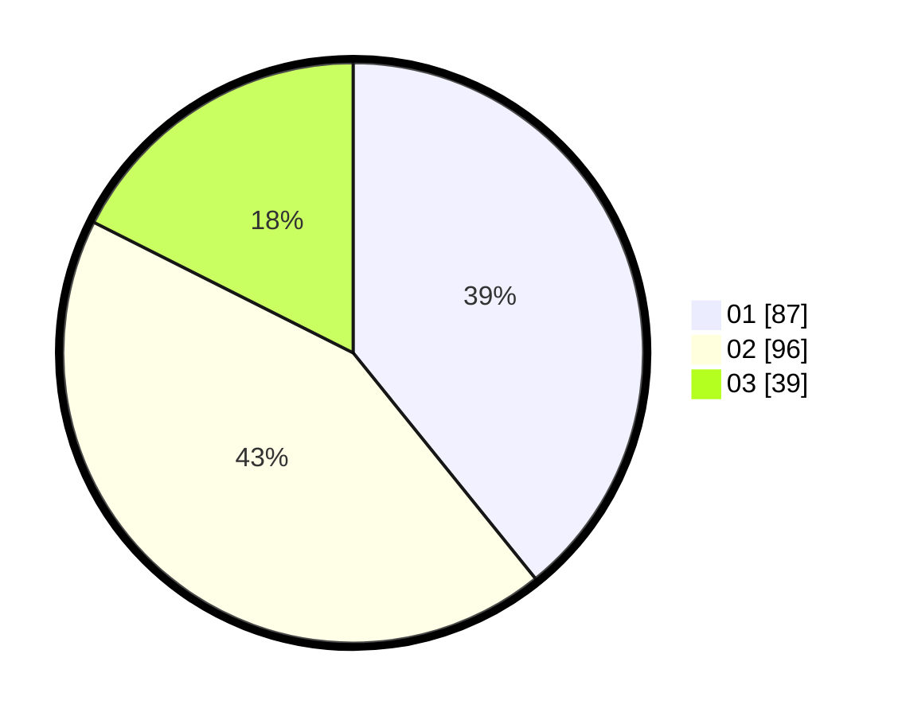

# Hasil

Hasil perolehan suara paslon dapat dilihat pada file paslon-01.txt, paslon-02.txt, dan paslon-03.txt.

Jika tidak ada, artinya data tersebut belum ada pada SIREKAP.

## Perolehan Suara

 * Paslon 01: **87**.
 * Paslon 02: **96**.
 * Paslon 03: **39**.

## Foto C Plano

https://sirekap-obj-formc.kpu.go.id/08a8/pemilu/ppwp/31/75/07/10/07/3175071007087-20240216-012931--a33b6a35-cd95-4608-8b50-2796a2f17d3c.jpg

https://sirekap-obj-formc.kpu.go.id/08a8/pemilu/ppwp/31/75/07/10/07/3175071007087-20240216-012934--b2b892b0-b136-422e-8fd0-4b595ee9c798.jpg

https://sirekap-obj-formc.kpu.go.id/08a8/pemilu/ppwp/31/75/07/10/07/3175071007087-20240216-012932--73e3aade-e666-48a1-9042-63de9f15060b.jpg

## DATA PEMILIH TETAP

Jumlah pemilih dalam DPT: **270**.
 * L: **124**.
 * P: **146**.

## DATA PENGGUNA HAK PILIH

Jumlah pengguna hak pilih dalam DPT: **215**.
 * L: **94**.
 * P: **121**.

Jumlah pengguna hak pilih dalam DPTb: **5**.
 * L: **4**.
 * P: **1**.

Jumlah pengguna hak pilih dalam DPK: **3**.
 * L: **1**.
 * P: **2**.

Jumlah pengguna hak pilih: **223**.
 * L: **99**.
 * P: **124**.

## JUMLAH SUARA SAH DAN TIDAK SAH

JUMLAH SELURUH SUARA SAH: **222**.

JUMLAH SUARA TIDAK SAH: **1**.

JUMLAH SELURUH SUARA SAH DAN SUARA TIDAK SAH: **223**.
