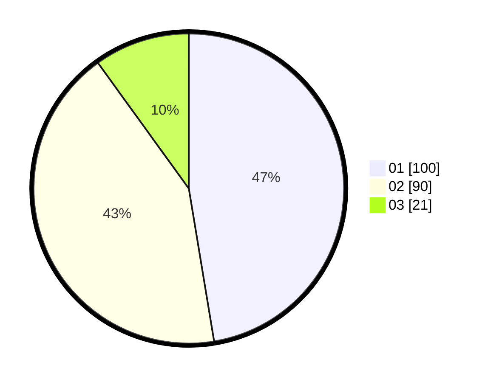

# Hasil

Hasil perolehan suara paslon dapat dilihat pada file paslon-01.txt, paslon-02.txt, dan paslon-03.txt.

Jika tidak ada, artinya data tersebut belum ada pada SIREKAP.

## Perolehan Suara

 * Paslon 01: **100**.
 * Paslon 02: **90**.
 * Paslon 03: **21**.

## Foto C Plano

https://sirekap-obj-formc.kpu.go.id/786e/pemilu/ppwp/31/75/07/10/07/3175071007088-20240216-061148--d9592073-18a8-4edf-9a50-1cad7d7cc7f3.jpg

https://sirekap-obj-formc.kpu.go.id/786e/pemilu/ppwp/31/75/07/10/07/3175071007088-20240216-061159--bd7898cd-ba85-48b4-be1e-81a85fd2f968.jpg

https://sirekap-obj-formc.kpu.go.id/786e/pemilu/ppwp/31/75/07/10/07/3175071007088-20240216-061803--7127bfb1-d4f9-44f0-9ced-f857f48e51d7.jpg

## DATA PEMILIH TETAP

Jumlah pemilih dalam DPT: **269**.
 * L: **135**.
 * P: **134**.

## DATA PENGGUNA HAK PILIH

Jumlah pengguna hak pilih dalam DPT: **210**.
 * L: **99**.
 * P: **111**.

Jumlah pengguna hak pilih dalam DPTb: **1**.
 * L: **1**.
 * P: **0**.

Jumlah pengguna hak pilih dalam DPK: **5**.
 * L: **1**.
 * P: **4**.

Jumlah pengguna hak pilih: **216**.
 * L: **101**.
 * P: **115**.

## JUMLAH SUARA SAH DAN TIDAK SAH

JUMLAH SELURUH SUARA SAH: **211**.

JUMLAH SUARA TIDAK SAH: **5**.

JUMLAH SELURUH SUARA SAH DAN SUARA TIDAK SAH: **216**.
