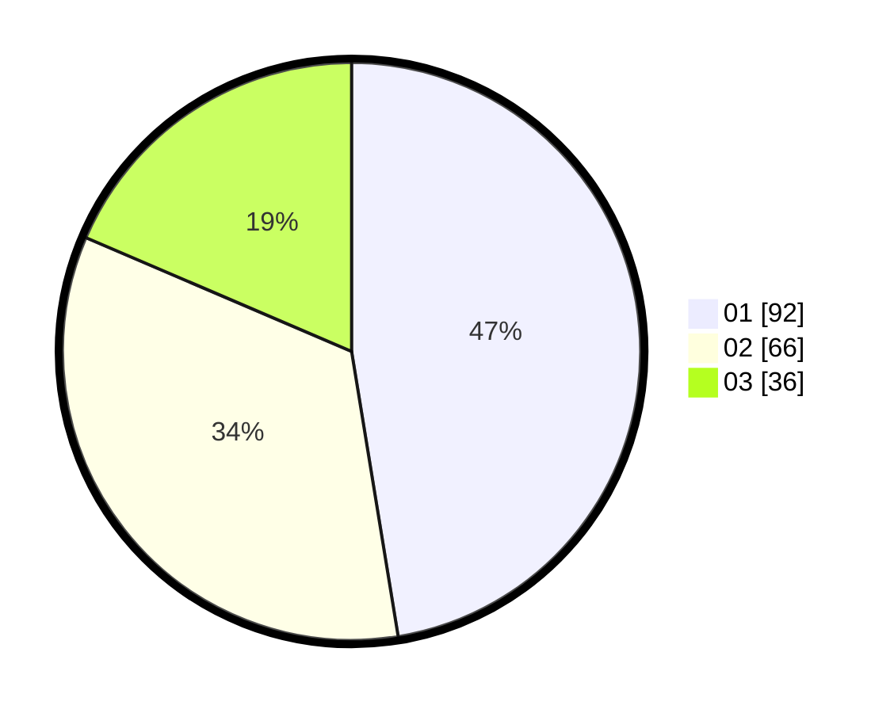

# Hasil

Hasil perolehan suara paslon dapat dilihat pada file paslon-01.txt, paslon-02.txt, dan paslon-03.txt.

Jika tidak ada, artinya data tersebut belum ada pada SIREKAP.

## Perolehan Suara

 * Paslon 01: **92**.
 * Paslon 02: **66**.
 * Paslon 03: **36**.

## Foto C Plano

https://sirekap-obj-formc.kpu.go.id/a1bd/pemilu/ppwp/31/75/07/10/07/3175071007092-20240214-160117--4ae488ed-0e48-4574-aabf-3471b5c0406e.jpg

https://sirekap-obj-formc.kpu.go.id/a1bd/pemilu/ppwp/31/75/07/10/07/3175071007092-20240214-160120--b349119b-cf02-4b18-bad3-65d9ae3cbb24.jpg

https://sirekap-obj-formc.kpu.go.id/a1bd/pemilu/ppwp/31/75/07/10/07/3175071007092-20240215-213319--9f4ce250-80cf-4614-b8b0-b72540f20f4d.jpg

## DATA PEMILIH TETAP

Jumlah pemilih dalam DPT: **255**.
 * L: **115**.
 * P: **140**.

## DATA PENGGUNA HAK PILIH

Jumlah pengguna hak pilih dalam DPT: **195**.
 * L: **82**.
 * P: **113**.

Jumlah pengguna hak pilih dalam DPTb: **0**.
 * L: **0**.
 * P: **0**.

Jumlah pengguna hak pilih dalam DPK: **3**.
 * L: **1**.
 * P: **2**.

Jumlah pengguna hak pilih: **198**.
 * L: **83**.
 * P: **115**.

## JUMLAH SUARA SAH DAN TIDAK SAH

JUMLAH SELURUH SUARA SAH: **194**.

JUMLAH SUARA TIDAK SAH: **4**.

JUMLAH SELURUH SUARA SAH DAN SUARA TIDAK SAH: **198**.
