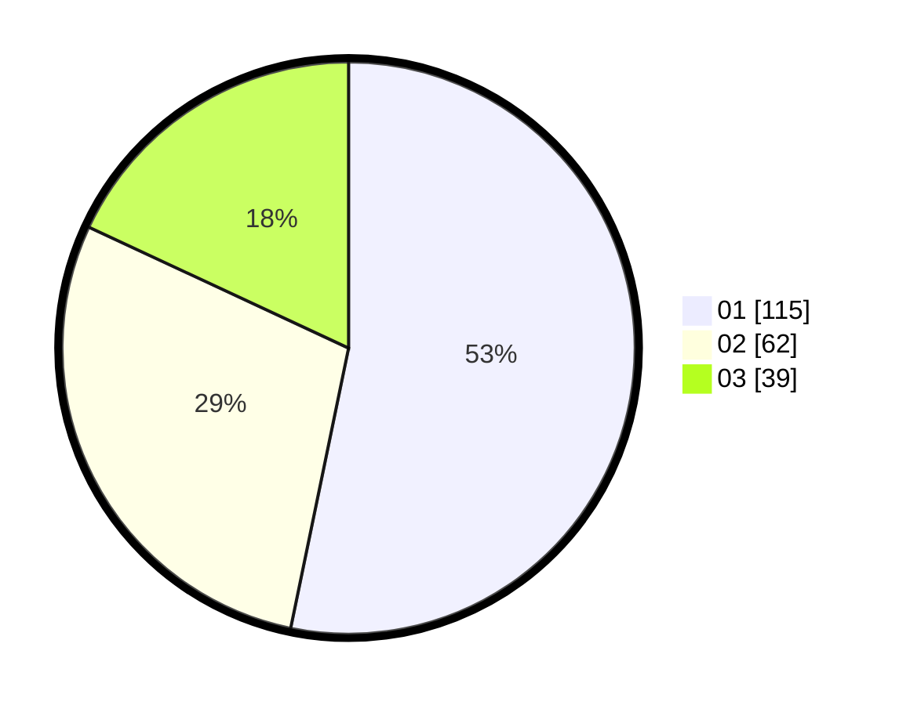

# Hasil

Hasil perolehan suara paslon dapat dilihat pada file paslon-01.txt, paslon-02.txt, dan paslon-03.txt.

Jika tidak ada, artinya data tersebut belum ada pada SIREKAP.

## Perolehan Suara

 * Paslon 01: **115**.
 * Paslon 02: **62**.
 * Paslon 03: **39**.

## Foto C Plano

https://sirekap-obj-formc.kpu.go.id/c472/pemilu/ppwp/31/75/07/10/07/3175071007097-20240216-073853--2e7fa041-24c5-4f58-ab2f-b17b76053cab.jpg

https://sirekap-obj-formc.kpu.go.id/c472/pemilu/ppwp/31/75/07/10/07/3175071007097-20240216-073911--830ad4cc-c980-479f-98c5-41209893b9eb.jpg

https://sirekap-obj-formc.kpu.go.id/c472/pemilu/ppwp/31/75/07/10/07/3175071007097-20240216-073903--31b3aaba-c32d-49ed-97e1-91d0af151a08.jpg

## DATA PEMILIH TETAP

Jumlah pemilih dalam DPT: **264**.
 * L: **131**.
 * P: **133**.

## DATA PENGGUNA HAK PILIH

Jumlah pengguna hak pilih dalam DPT: **218**.
 * L: **106**.
 * P: **112**.

Jumlah pengguna hak pilih dalam DPTb: **0**.
 * L: **0**.
 * P: **0**.

Jumlah pengguna hak pilih dalam DPK: **0**.
 * L: **0**.
 * P: **0**.

Jumlah pengguna hak pilih: **218**.
 * L: **106**.
 * P: **112**.

## JUMLAH SUARA SAH DAN TIDAK SAH

JUMLAH SELURUH SUARA SAH: **216**.

JUMLAH SUARA TIDAK SAH: **2**.

JUMLAH SELURUH SUARA SAH DAN SUARA TIDAK SAH: **218**.
