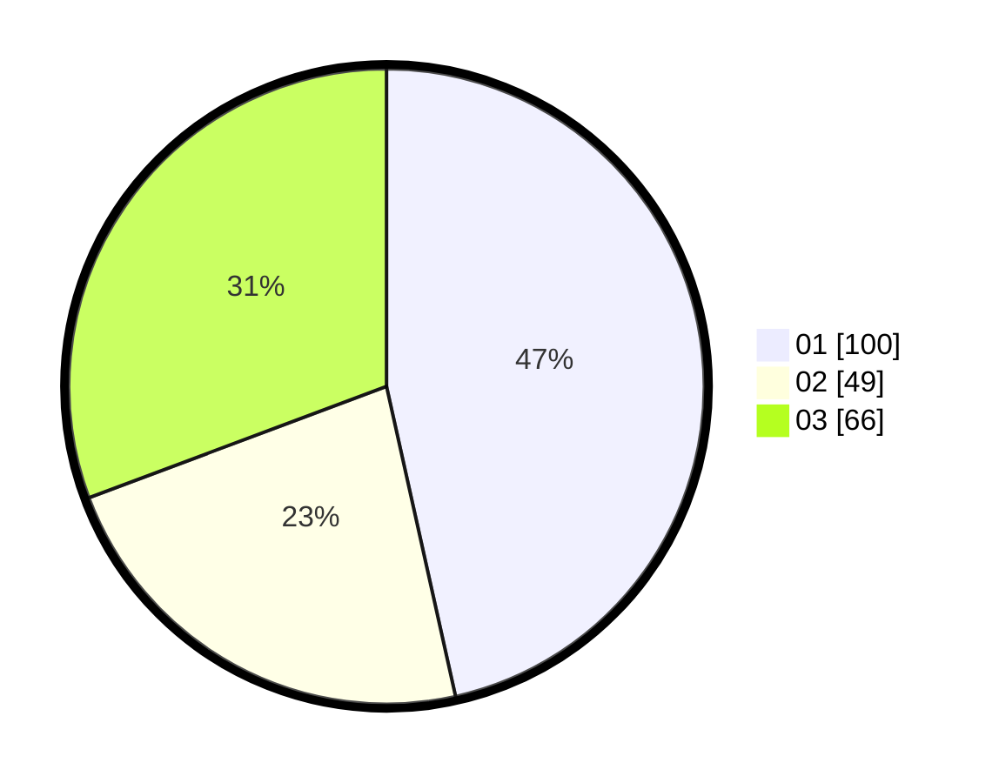

# Hasil

Hasil perolehan suara paslon dapat dilihat pada file paslon-01.txt, paslon-02.txt, dan paslon-03.txt.

Jika tidak ada, artinya data tersebut belum ada pada SIREKAP.

## Perolehan Suara

 * Paslon 01: **100**.
 * Paslon 02: **49**.
 * Paslon 03: **66**.

## Foto C Plano

https://sirekap-obj-formc.kpu.go.id/24e0/pemilu/ppwp/31/75/07/10/07/3175071007099-20240216-135505--6a0d2d40-46bd-44a8-9e04-d51b54d23a6b.jpg

https://sirekap-obj-formc.kpu.go.id/24e0/pemilu/ppwp/31/75/07/10/07/3175071007099-20240216-135506--be58eac7-786f-46c7-9c74-c5cee68ebaf1.jpg

https://sirekap-obj-formc.kpu.go.id/24e0/pemilu/ppwp/31/75/07/10/07/3175071007099-20240216-135506--577ee824-36de-4b57-8e66-53ea2b1f695a.jpg

## DATA PEMILIH TETAP

Jumlah pemilih dalam DPT: **247**.
 * L: **118**.
 * P: **129**.

## DATA PENGGUNA HAK PILIH

Jumlah pengguna hak pilih dalam DPT: **212**.
 * L: **93**.
 * P: **119**.

Jumlah pengguna hak pilih dalam DPTb: **1**.
 * L: **1**.
 * P: **0**.

Jumlah pengguna hak pilih dalam DPK: **2**.
 * L: **0**.
 * P: **2**.

Jumlah pengguna hak pilih: **215**.
 * L: **94**.
 * P: **121**.

## JUMLAH SUARA SAH DAN TIDAK SAH

JUMLAH SELURUH SUARA SAH: **215**.

JUMLAH SUARA TIDAK SAH: **0**.

JUMLAH SELURUH SUARA SAH DAN SUARA TIDAK SAH: **215**.
