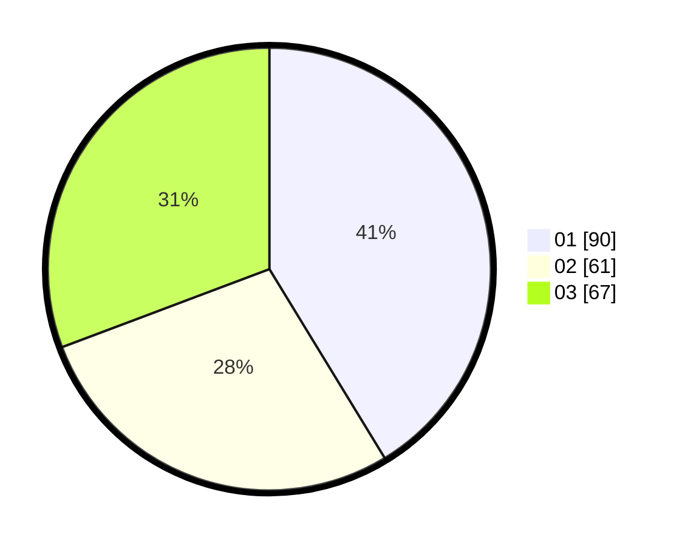

# Hasil

Hasil perolehan suara paslon dapat dilihat pada file paslon-01.txt, paslon-02.txt, dan paslon-03.txt.

Jika tidak ada, artinya data tersebut belum ada pada SIREKAP.

## Perolehan Suara

 * Paslon 01: **90**.
 * Paslon 02: **61**.
 * Paslon 03: **67**.

## Foto C Plano

https://sirekap-obj-formc.kpu.go.id/4708/pemilu/ppwp/31/75/07/10/07/3175071007102-20240214-184848--8bde17c4-f895-45bb-b466-df5d7e8db674.jpg

https://sirekap-obj-formc.kpu.go.id/4708/pemilu/ppwp/31/75/07/10/07/3175071007102-20240214-184907--ef5bd3b0-13c7-45a4-8e65-62fead36f77f.jpg

https://sirekap-obj-formc.kpu.go.id/4708/pemilu/ppwp/31/75/07/10/07/3175071007102-20240214-184925--a2bfb257-c888-424f-baf4-2185815c1408.jpg

## DATA PEMILIH TETAP

Jumlah pemilih dalam DPT: **268**.
 * L: **124**.
 * P: **144**.

## DATA PENGGUNA HAK PILIH

Jumlah pengguna hak pilih dalam DPT: **217**.
 * L: **99**.
 * P: **118**.

Jumlah pengguna hak pilih dalam DPTb: **6**.
 * L: **2**.
 * P: **4**.

Jumlah pengguna hak pilih dalam DPK: **0**.
 * L: **0**.
 * P: **0**.

Jumlah pengguna hak pilih: **223**.
 * L: **101**.
 * P: **122**.

## JUMLAH SUARA SAH DAN TIDAK SAH

JUMLAH SELURUH SUARA SAH: **218**.

JUMLAH SUARA TIDAK SAH: **5**.

JUMLAH SELURUH SUARA SAH DAN SUARA TIDAK SAH: **223**.
