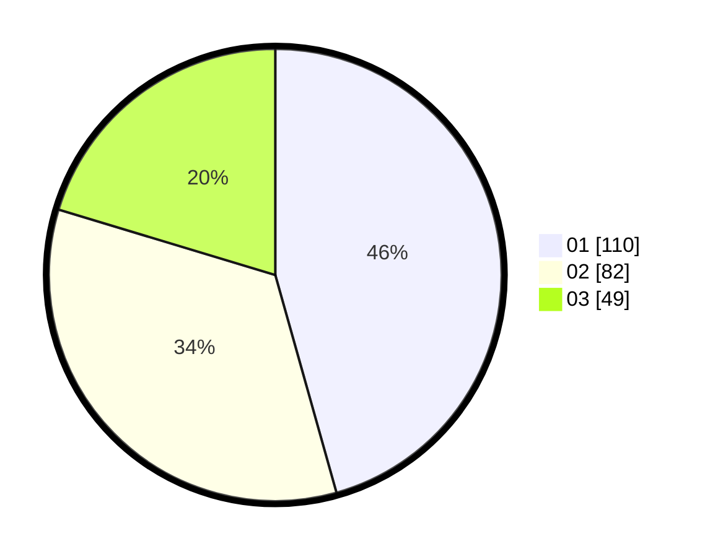

# Hasil

Hasil perolehan suara paslon dapat dilihat pada file paslon-01.txt, paslon-02.txt, dan paslon-03.txt.

Jika tidak ada, artinya data tersebut belum ada pada SIREKAP.

## Perolehan Suara

 * Paslon 01: **110**.
 * Paslon 02: **82**.
 * Paslon 03: **49**.

## Foto C Plano

https://sirekap-obj-formc.kpu.go.id/4cd6/pemilu/ppwp/31/75/07/10/07/3175071007103-20240215-111913--f7ffcc14-8467-45e9-955a-c1fdaf374c4e.jpg

https://sirekap-obj-formc.kpu.go.id/4cd6/pemilu/ppwp/31/75/07/10/07/3175071007103-20240215-111935--0c033ea5-7ca5-43f8-8481-62010bfb58a9.jpg

https://sirekap-obj-formc.kpu.go.id/4cd6/pemilu/ppwp/31/75/07/10/07/3175071007103-20240215-111924--a217378e-16f2-4d2f-a4ee-91a95180b5b6.jpg

## DATA PEMILIH TETAP

Jumlah pemilih dalam DPT: **267**.
 * L: **127**.
 * P: **140**.

## DATA PENGGUNA HAK PILIH

Jumlah pengguna hak pilih dalam DPT: **235**.
 * L: **106**.
 * P: **129**.

Jumlah pengguna hak pilih dalam DPTb: **11**.
 * L: **4**.
 * P: **7**.

Jumlah pengguna hak pilih dalam DPK: **0**.
 * L: **0**.
 * P: **0**.

Jumlah pengguna hak pilih: **246**.
 * L: **110**.
 * P: **136**.

## JUMLAH SUARA SAH DAN TIDAK SAH

JUMLAH SELURUH SUARA SAH: **241**.

JUMLAH SUARA TIDAK SAH: **5**.

JUMLAH SELURUH SUARA SAH DAN SUARA TIDAK SAH: **246**.
