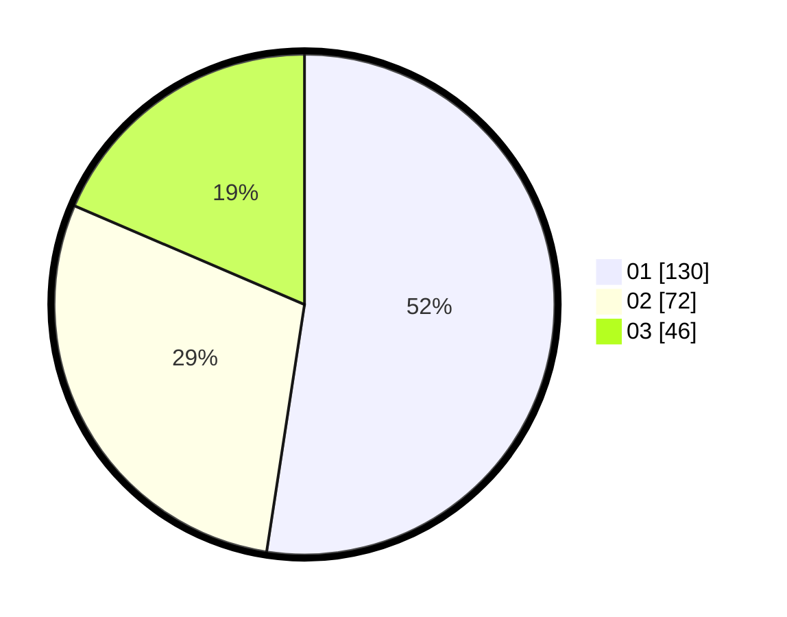

# Hasil

Hasil perolehan suara paslon dapat dilihat pada file paslon-01.txt, paslon-02.txt, dan paslon-03.txt.

Jika tidak ada, artinya data tersebut belum ada pada SIREKAP.

## Perolehan Suara

 * Paslon 01: **130**.
 * Paslon 02: **72**.
 * Paslon 03: **46**.

## Foto C Plano

https://sirekap-obj-formc.kpu.go.id/1bf7/pemilu/ppwp/31/75/07/10/07/3175071007104-20240216-054850--8651f653-55ca-4775-b2ba-3fbf8cb8d05e.jpg

https://sirekap-obj-formc.kpu.go.id/1bf7/pemilu/ppwp/31/75/07/10/07/3175071007104-20240216-083409--2b45bc64-84f2-4b5d-91ec-3dfcd70c4321.jpg

https://sirekap-obj-formc.kpu.go.id/1bf7/pemilu/ppwp/31/75/07/10/07/3175071007104-20240216-083408--a6b3cf25-347b-4255-82d8-e847f62a3649.jpg

## DATA PEMILIH TETAP

Jumlah pemilih dalam DPT: **0**.
 * L: **0**.
 * P: **0**.

## DATA PENGGUNA HAK PILIH

Jumlah pengguna hak pilih dalam DPT: **0**.
 * L: **0**.
 * P: **0**.

Jumlah pengguna hak pilih dalam DPTb: **0**.
 * L: **0**.
 * P: **0**.

Jumlah pengguna hak pilih dalam DPK: **0**.
 * L: **0**.
 * P: **0**.

Jumlah pengguna hak pilih: **0**.
 * L: **0**.
 * P: **0**.

## JUMLAH SUARA SAH DAN TIDAK SAH

JUMLAH SELURUH SUARA SAH: **248**.

JUMLAH SUARA TIDAK SAH: **6**.

JUMLAH SELURUH SUARA SAH DAN SUARA TIDAK SAH: **254**.
