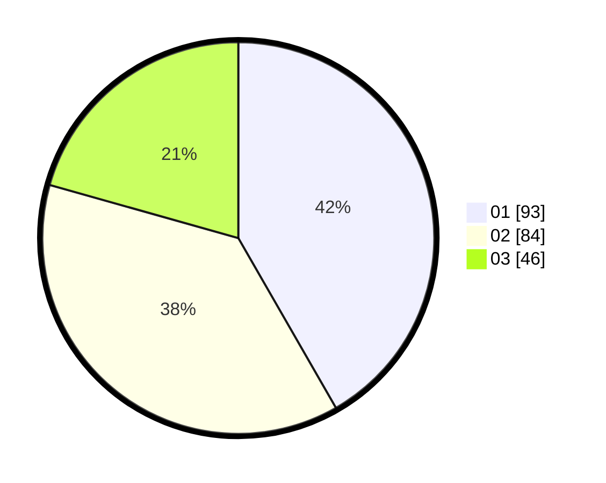

# Hasil

Hasil perolehan suara paslon dapat dilihat pada file paslon-01.txt, paslon-02.txt, dan paslon-03.txt.

Jika tidak ada, artinya data tersebut belum ada pada SIREKAP.

## Perolehan Suara

 * Paslon 01: **93**.
 * Paslon 02: **84**.
 * Paslon 03: **46**.

## Foto C Plano

https://sirekap-obj-formc.kpu.go.id/6c05/pemilu/ppwp/31/75/07/10/07/3175071007105-20240216-035151--b39f074d-515e-42ff-8457-51c25c2a544c.jpg

https://sirekap-obj-formc.kpu.go.id/6c05/pemilu/ppwp/31/75/07/10/07/3175071007105-20240216-034801--dcb1c718-b0e3-4b39-af05-61c841f473bf.jpg

https://sirekap-obj-formc.kpu.go.id/6c05/pemilu/ppwp/31/75/07/10/07/3175071007105-20240216-034755--60361684-9a19-4cef-a52c-40b41df0c6d6.jpg

## DATA PEMILIH TETAP

Jumlah pemilih dalam DPT: **268**.
 * L: **122**.
 * P: **146**.

## DATA PENGGUNA HAK PILIH

Jumlah pengguna hak pilih dalam DPT: **220**.
 * L: **102**.
 * P: **118**.

Jumlah pengguna hak pilih dalam DPTb: **3**.
 * L: **3**.
 * P: **0**.

Jumlah pengguna hak pilih dalam DPK: **4**.
 * L: **1**.
 * P: **3**.

Jumlah pengguna hak pilih: **227**.
 * L: **106**.
 * P: **121**.

## JUMLAH SUARA SAH DAN TIDAK SAH

JUMLAH SELURUH SUARA SAH: **223**.

JUMLAH SUARA TIDAK SAH: **4**.

JUMLAH SELURUH SUARA SAH DAN SUARA TIDAK SAH: **227**.
