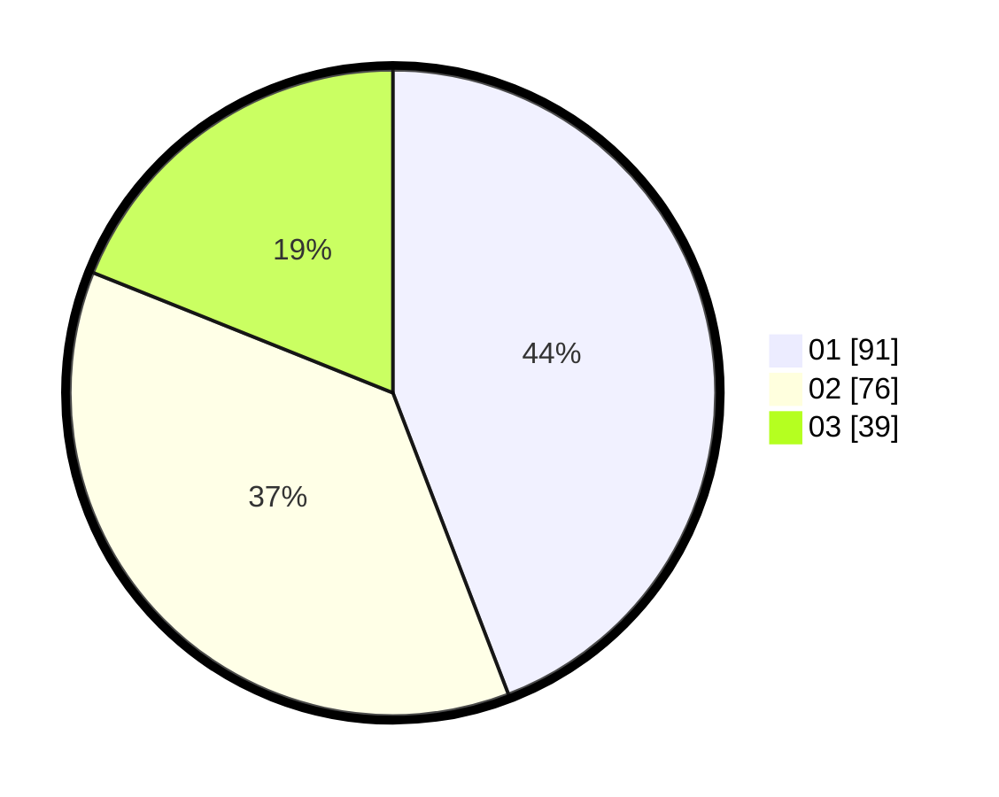

# Hasil

Hasil perolehan suara paslon dapat dilihat pada file paslon-01.txt, paslon-02.txt, dan paslon-03.txt.

Jika tidak ada, artinya data tersebut belum ada pada SIREKAP.

## Perolehan Suara

 * Paslon 01: **91**.
 * Paslon 02: **76**.
 * Paslon 03: **39**.

## Foto C Plano

https://sirekap-obj-formc.kpu.go.id/08ad/pemilu/ppwp/31/75/07/10/07/3175071007114-20240215-213301--3d6087ec-54ab-4378-a8e2-6ad4f5afa349.jpg

https://sirekap-obj-formc.kpu.go.id/08ad/pemilu/ppwp/31/75/07/10/07/3175071007114-20240215-213303--6b43983a-4f8e-4097-9c5e-7293df7256c2.jpg

https://sirekap-obj-formc.kpu.go.id/08ad/pemilu/ppwp/31/75/07/10/07/3175071007114-20240215-213302--842e82c6-9e10-43f4-b0e9-d27e6d4a5d99.jpg

## DATA PEMILIH TETAP

Jumlah pemilih dalam DPT: **252**.
 * L: **129**.
 * P: **123**.

## DATA PENGGUNA HAK PILIH

Jumlah pengguna hak pilih dalam DPT: **209**.
 * L: **109**.
 * P: **100**.

Jumlah pengguna hak pilih dalam DPTb: **0**.
 * L: **0**.
 * P: **0**.

Jumlah pengguna hak pilih dalam DPK: **1**.
 * L: **0**.
 * P: **1**.

Jumlah pengguna hak pilih: **210**.
 * L: **109**.
 * P: **101**.

## JUMLAH SUARA SAH DAN TIDAK SAH

JUMLAH SELURUH SUARA SAH: **206**.

JUMLAH SUARA TIDAK SAH: **4**.

JUMLAH SELURUH SUARA SAH DAN SUARA TIDAK SAH: **210**.
