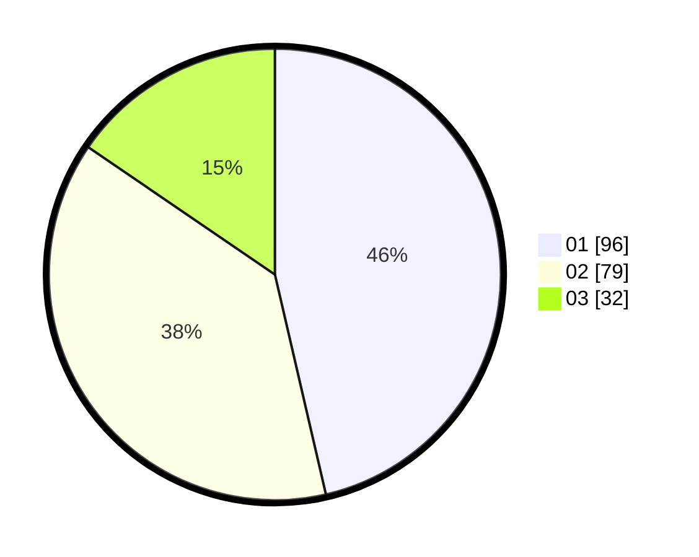

# Hasil

Hasil perolehan suara paslon dapat dilihat pada file paslon-01.txt, paslon-02.txt, dan paslon-03.txt.

Jika tidak ada, artinya data tersebut belum ada pada SIREKAP.

## Perolehan Suara

 * Paslon 01: **96**.
 * Paslon 02: **79**.
 * Paslon 03: **32**.

## Foto C Plano

https://sirekap-obj-formc.kpu.go.id/63e6/pemilu/ppwp/31/75/07/10/07/3175071007116-20240215-081354--b23dc4b7-ae97-48c6-9f05-01e7684fe1b3.jpg

https://sirekap-obj-formc.kpu.go.id/63e6/pemilu/ppwp/31/75/07/10/07/3175071007116-20240215-081415--5c110ef6-81d3-41a2-a296-5902e0f1471c.jpg

https://sirekap-obj-formc.kpu.go.id/63e6/pemilu/ppwp/31/75/07/10/07/3175071007116-20240215-081404--e3872a92-e1e0-4171-8a0a-a510d951c4fc.jpg

## DATA PEMILIH TETAP

Jumlah pemilih dalam DPT: **255**.
 * L: **134**.
 * P: **121**.

## DATA PENGGUNA HAK PILIH

Jumlah pengguna hak pilih dalam DPT: **211**.
 * L: **112**.
 * P: **99**.

Jumlah pengguna hak pilih dalam DPTb: **1**.
 * L: **0**.
 * P: **1**.

Jumlah pengguna hak pilih dalam DPK: **0**.
 * L: **0**.
 * P: **0**.

Jumlah pengguna hak pilih: **212**.
 * L: **112**.
 * P: **100**.

## JUMLAH SUARA SAH DAN TIDAK SAH

JUMLAH SELURUH SUARA SAH: **207**.

JUMLAH SUARA TIDAK SAH: **5**.

JUMLAH SELURUH SUARA SAH DAN SUARA TIDAK SAH: **212**.
