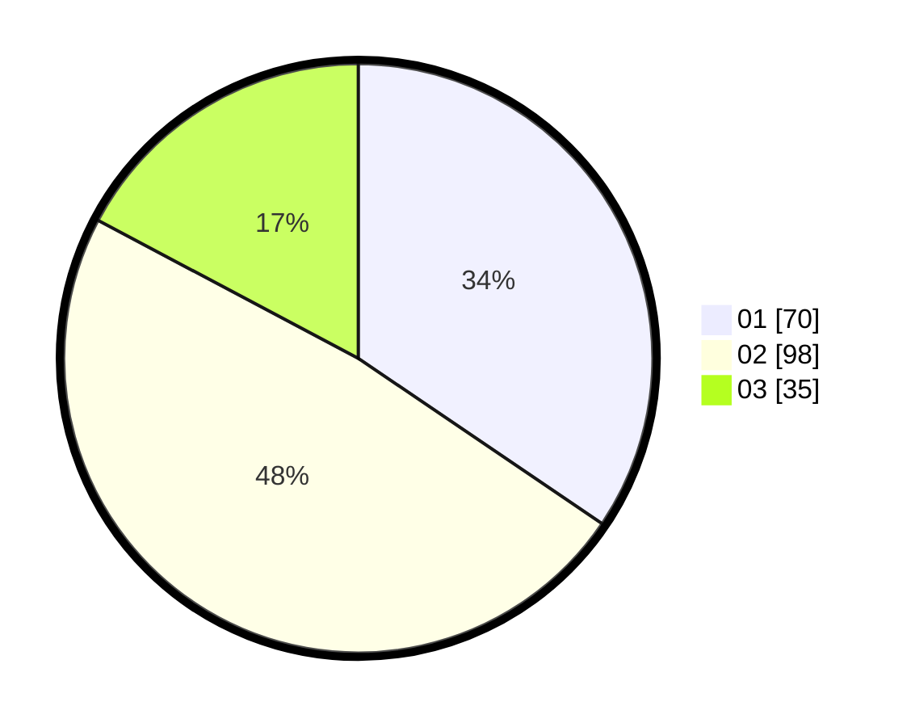

# Hasil

Hasil perolehan suara paslon dapat dilihat pada file paslon-01.txt, paslon-02.txt, dan paslon-03.txt.

Jika tidak ada, artinya data tersebut belum ada pada SIREKAP.

## Perolehan Suara

 * Paslon 01: **70**.
 * Paslon 02: **98**.
 * Paslon 03: **35**.

## Foto C Plano

https://sirekap-obj-formc.kpu.go.id/22c3/pemilu/ppwp/31/75/07/10/07/3175071007118-20240214-232602--96ee3207-efcd-4d70-a767-a4b56b0e847f.jpg

https://sirekap-obj-formc.kpu.go.id/22c3/pemilu/ppwp/31/75/07/10/07/3175071007118-20240215-225007--a6e8632d-53b8-44f1-b278-0d56b9d990b0.jpg

https://sirekap-obj-formc.kpu.go.id/22c3/pemilu/ppwp/31/75/07/10/07/3175071007118-20240214-232714--ed75a600-cde3-4eea-95d6-2709b297d57f.jpg

## DATA PEMILIH TETAP

Jumlah pemilih dalam DPT: **257**.
 * L: **128**.
 * P: **129**.

## DATA PENGGUNA HAK PILIH

Jumlah pengguna hak pilih dalam DPT: **203**.
 * L: **100**.
 * P: **103**.

Jumlah pengguna hak pilih dalam DPTb: **0**.
 * L: **0**.
 * P: **0**.

Jumlah pengguna hak pilih dalam DPK: **0**.
 * L: **0**.
 * P: **0**.

Jumlah pengguna hak pilih: **203**.
 * L: **100**.
 * P: **103**.

## JUMLAH SUARA SAH DAN TIDAK SAH

JUMLAH SELURUH SUARA SAH: **203**.

JUMLAH SUARA TIDAK SAH: **0**.

JUMLAH SELURUH SUARA SAH DAN SUARA TIDAK SAH: **203**.
