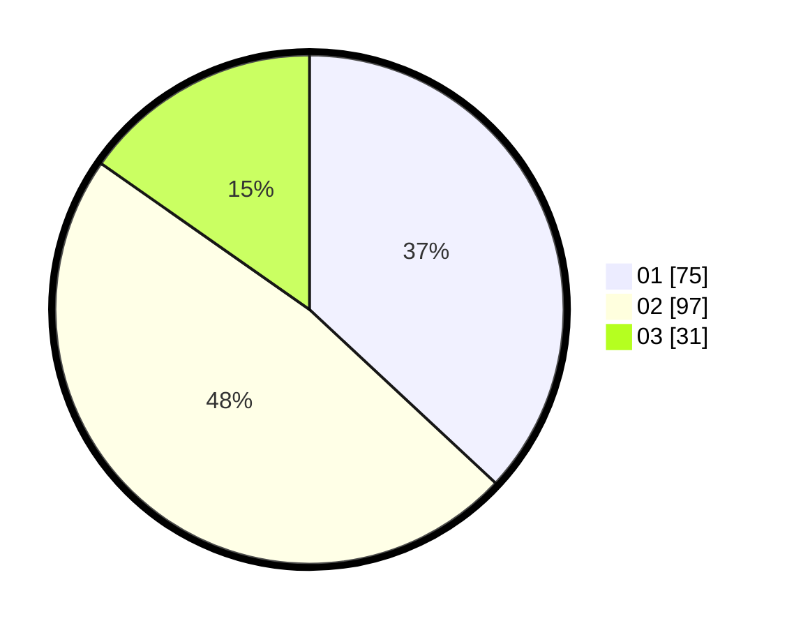

# Hasil

Hasil perolehan suara paslon dapat dilihat pada file paslon-01.txt, paslon-02.txt, dan paslon-03.txt.

Jika tidak ada, artinya data tersebut belum ada pada SIREKAP.

## Perolehan Suara

 * Paslon 01: **75**.
 * Paslon 02: **97**.
 * Paslon 03: **31**.

## Foto C Plano

https://sirekap-obj-formc.kpu.go.id/99b4/pemilu/ppwp/31/75/07/10/07/3175071007120-20240214-231515--225958b3-6cb5-450a-8526-4585b5525ca9.jpg

https://sirekap-obj-formc.kpu.go.id/99b4/pemilu/ppwp/31/75/07/10/07/3175071007120-20240214-231603--5c906655-0be0-4592-87fd-667745df9c1e.jpg

https://sirekap-obj-formc.kpu.go.id/99b4/pemilu/ppwp/31/75/07/10/07/3175071007120-20240214-231730--25559ded-f7a8-4fb3-b607-bdc484c8d35e.jpg
