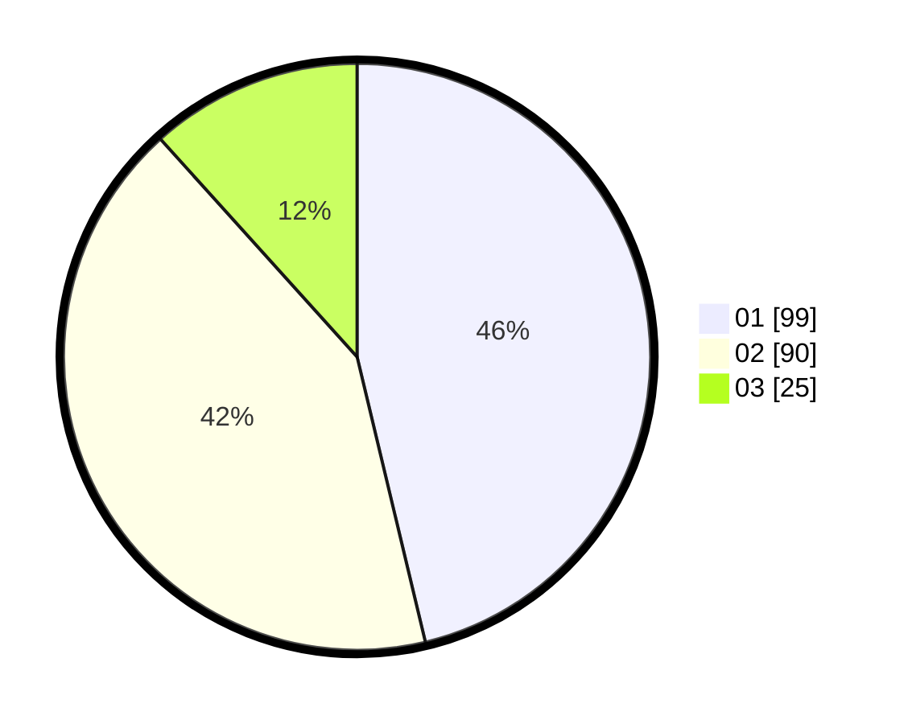

# Hasil

Hasil perolehan suara paslon dapat dilihat pada file paslon-01.txt, paslon-02.txt, dan paslon-03.txt.

Jika tidak ada, artinya data tersebut belum ada pada SIREKAP.

## Perolehan Suara

 * Paslon 01: **99**.
 * Paslon 02: **90**.
 * Paslon 03: **25**.

## Foto C Plano

https://sirekap-obj-formc.kpu.go.id/36a3/pemilu/ppwp/31/75/08/10/01/3175081001003-20240215-034153--4574989a-42f8-4860-8f28-f397f4fdc080.jpg

https://sirekap-obj-formc.kpu.go.id/36a3/pemilu/ppwp/31/75/08/10/01/3175081001003-20240215-034250--9c03c3d3-3572-4dc1-bec8-565de6c4efcb.jpg

https://sirekap-obj-formc.kpu.go.id/36a3/pemilu/ppwp/31/75/08/10/01/3175081001003-20240215-034345--43f0a3bb-4304-46bf-88e5-a8c3e3040711.jpg
