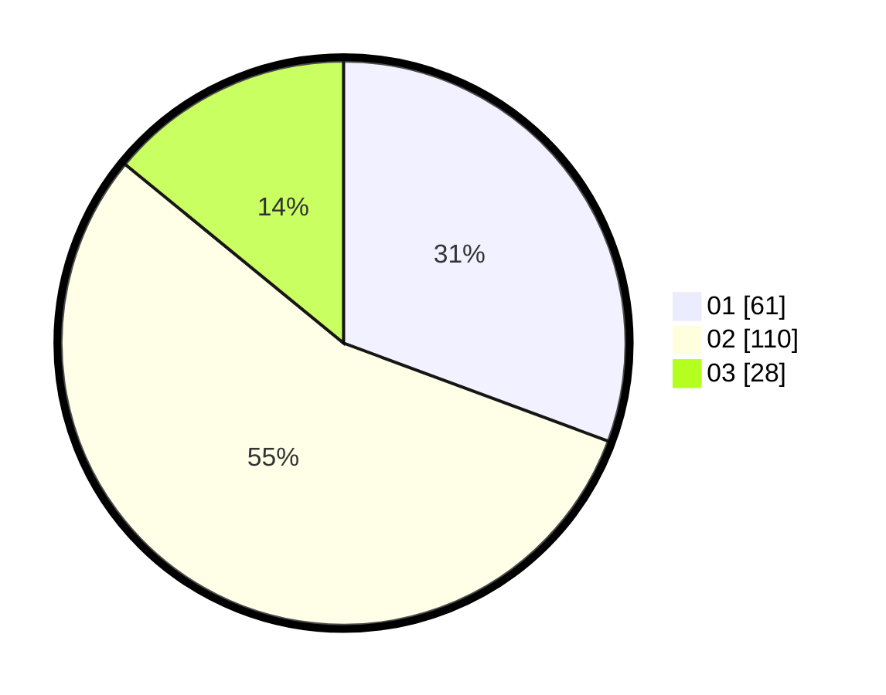

# Hasil

Hasil perolehan suara paslon dapat dilihat pada file paslon-01.txt, paslon-02.txt, dan paslon-03.txt.

Jika tidak ada, artinya data tersebut belum ada pada SIREKAP.

## Perolehan Suara

 * Paslon 01: **61**.
 * Paslon 02: **110**.
 * Paslon 03: **28**.

## Foto C Plano

https://sirekap-obj-formc.kpu.go.id/df41/pemilu/ppwp/31/75/08/10/01/3175081001006-20240216-070059--d5ba8959-75c8-41ab-9dd6-19ce95c5dedc.jpg

https://sirekap-obj-formc.kpu.go.id/df41/pemilu/ppwp/31/75/08/10/01/3175081001006-20240216-070101--287ca57c-4d01-4375-ab7a-34ae375fa7d8.jpg

https://sirekap-obj-formc.kpu.go.id/df41/pemilu/ppwp/31/75/08/10/01/3175081001006-20240216-070100--daf8622b-416c-43fb-91ba-55e5117a4631.jpg

## DATA PEMILIH TETAP

Jumlah pemilih dalam DPT: **268**.
 * L: **130**.
 * P: **138**.

## DATA PENGGUNA HAK PILIH

Jumlah pengguna hak pilih dalam DPT: **204**.
 * L: **98**.
 * P: **106**.

Jumlah pengguna hak pilih dalam DPTb: **0**.
 * L: **0**.
 * P: **0**.

Jumlah pengguna hak pilih dalam DPK: **1**.
 * L: **1**.
 * P: **0**.

Jumlah pengguna hak pilih: **205**.
 * L: **99**.
 * P: **106**.

## JUMLAH SUARA SAH DAN TIDAK SAH

JUMLAH SELURUH SUARA SAH: **199**.

JUMLAH SUARA TIDAK SAH: **6**.

JUMLAH SELURUH SUARA SAH DAN SUARA TIDAK SAH: **205**.
