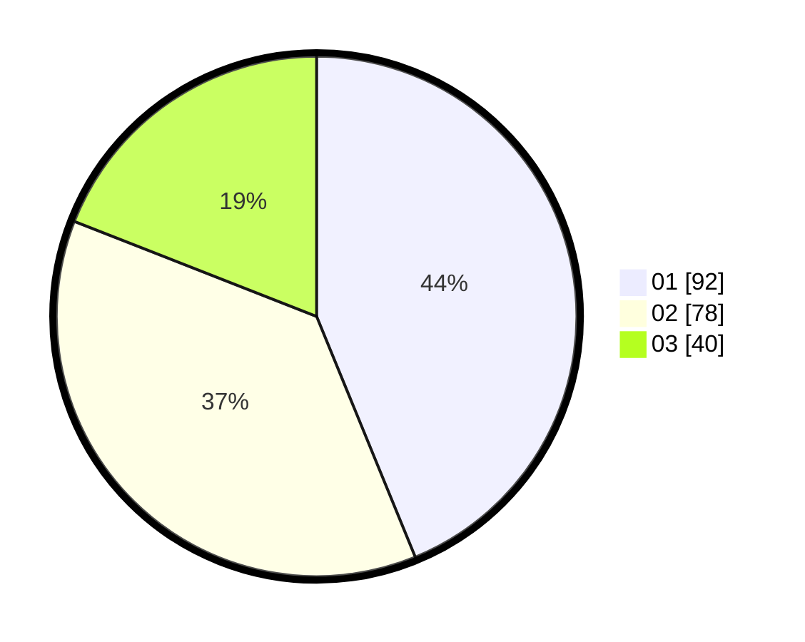

# Hasil

Hasil perolehan suara paslon dapat dilihat pada file paslon-01.txt, paslon-02.txt, dan paslon-03.txt.

Jika tidak ada, artinya data tersebut belum ada pada SIREKAP.

## Perolehan Suara

 * Paslon 01: **92**.
 * Paslon 02: **78**.
 * Paslon 03: **40**.

## Foto C Plano

https://sirekap-obj-formc.kpu.go.id/fb02/pemilu/ppwp/31/75/08/10/01/3175081001014-20240215-005308--c4805d96-9f7b-4880-b644-d0fea043c901.jpg

https://sirekap-obj-formc.kpu.go.id/fb02/pemilu/ppwp/31/75/08/10/01/3175081001014-20240215-005348--84753cdc-f557-4521-954c-f16ca5880bae.jpg

https://sirekap-obj-formc.kpu.go.id/fb02/pemilu/ppwp/31/75/08/10/01/3175081001014-20240215-005545--2288d22e-fd03-4bbf-af06-3d54a96ec34f.jpg
