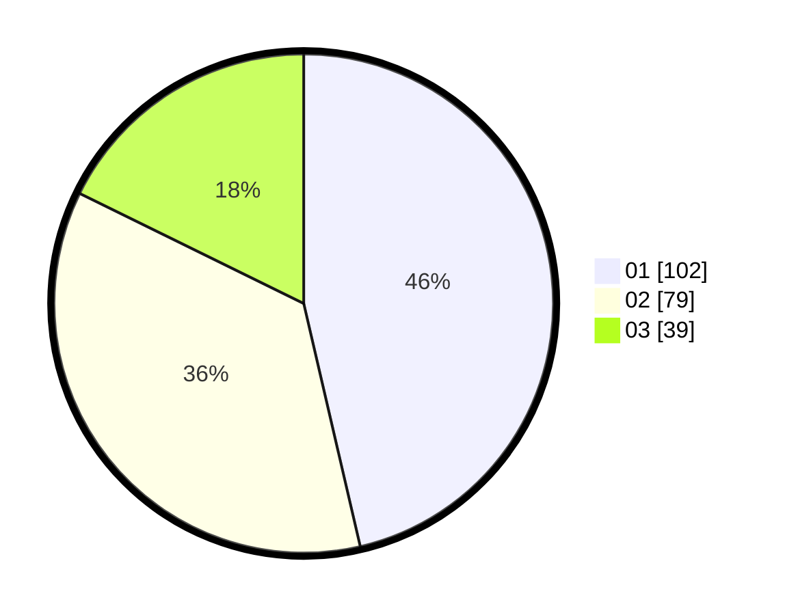

# Hasil

Hasil perolehan suara paslon dapat dilihat pada file paslon-01.txt, paslon-02.txt, dan paslon-03.txt.

Jika tidak ada, artinya data tersebut belum ada pada SIREKAP.

## Perolehan Suara

 * Paslon 01: **102**.
 * Paslon 02: **79**.
 * Paslon 03: **39**.

## Foto C Plano

https://sirekap-obj-formc.kpu.go.id/29cd/pemilu/ppwp/31/75/08/10/01/3175081001016-20240214-224531--368baaed-1db1-4382-844b-92332185d6d7.jpg

https://sirekap-obj-formc.kpu.go.id/29cd/pemilu/ppwp/31/75/08/10/01/3175081001016-20240214-224551--c799e5d0-007c-46ac-95f7-429b3a27c62b.jpg

https://sirekap-obj-formc.kpu.go.id/29cd/pemilu/ppwp/31/75/08/10/01/3175081001016-20240218-095915--137a54e6-9661-4e68-9978-825670fcc950.jpg
