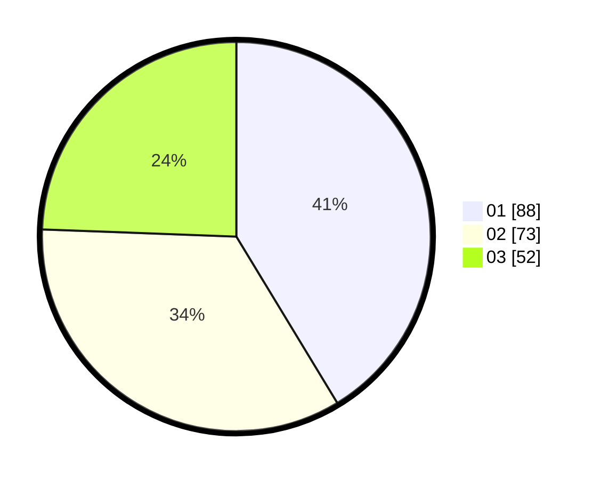

# Hasil

Hasil perolehan suara paslon dapat dilihat pada file paslon-01.txt, paslon-02.txt, dan paslon-03.txt.

Jika tidak ada, artinya data tersebut belum ada pada SIREKAP.

## Perolehan Suara

 * Paslon 01: **88**.
 * Paslon 02: **73**.
 * Paslon 03: **52**.

## Foto C Plano

https://sirekap-obj-formc.kpu.go.id/0c5c/pemilu/ppwp/31/75/08/10/01/3175081001018-20240214-215055--a8ecdfa1-c1ac-4c2f-b392-60060e0924d0.jpg

https://sirekap-obj-formc.kpu.go.id/0c5c/pemilu/ppwp/31/75/08/10/01/3175081001018-20240214-215318--74c23da9-4666-417a-92d6-1e6ec68e21a2.jpg

https://sirekap-obj-formc.kpu.go.id/0c5c/pemilu/ppwp/31/75/08/10/01/3175081001018-20240214-215508--4949296e-a7a2-4509-acd3-4b7b524c39dc.jpg
