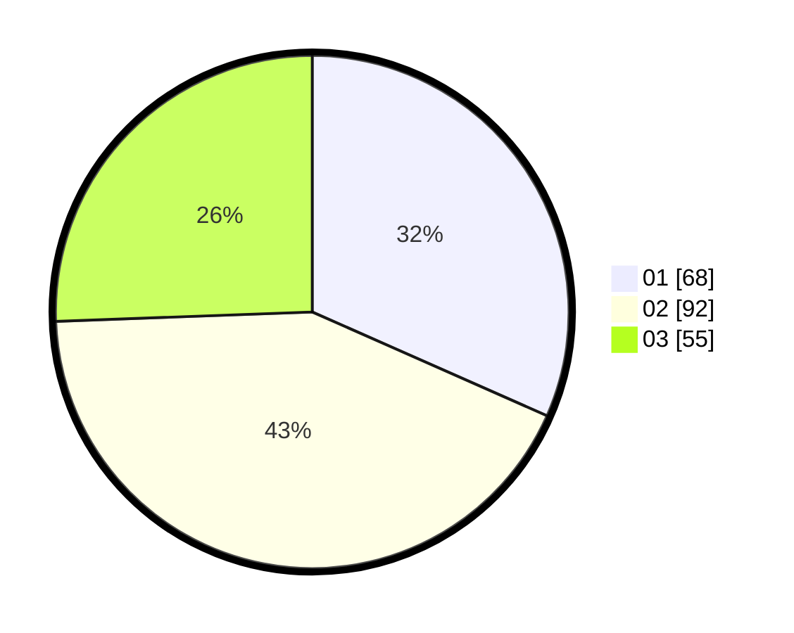

# Hasil

Hasil perolehan suara paslon dapat dilihat pada file paslon-01.txt, paslon-02.txt, dan paslon-03.txt.

Jika tidak ada, artinya data tersebut belum ada pada SIREKAP.

## Perolehan Suara

 * Paslon 01: **68**.
 * Paslon 02: **92**.
 * Paslon 03: **55**.

## Foto C Plano

https://sirekap-obj-formc.kpu.go.id/af7a/pemilu/ppwp/31/75/08/10/01/3175081001021-20240214-221854--7c1b479e-17b2-482b-a685-668fe6731a01.jpg

https://sirekap-obj-formc.kpu.go.id/af7a/pemilu/ppwp/31/75/08/10/01/3175081001021-20240214-221915--2bdc84ef-4a4d-450d-9870-89328fd9630b.jpg

https://sirekap-obj-formc.kpu.go.id/af7a/pemilu/ppwp/31/75/08/10/01/3175081001021-20240214-222300--3a943518-c49b-434e-a74f-e691751c7e91.jpg
