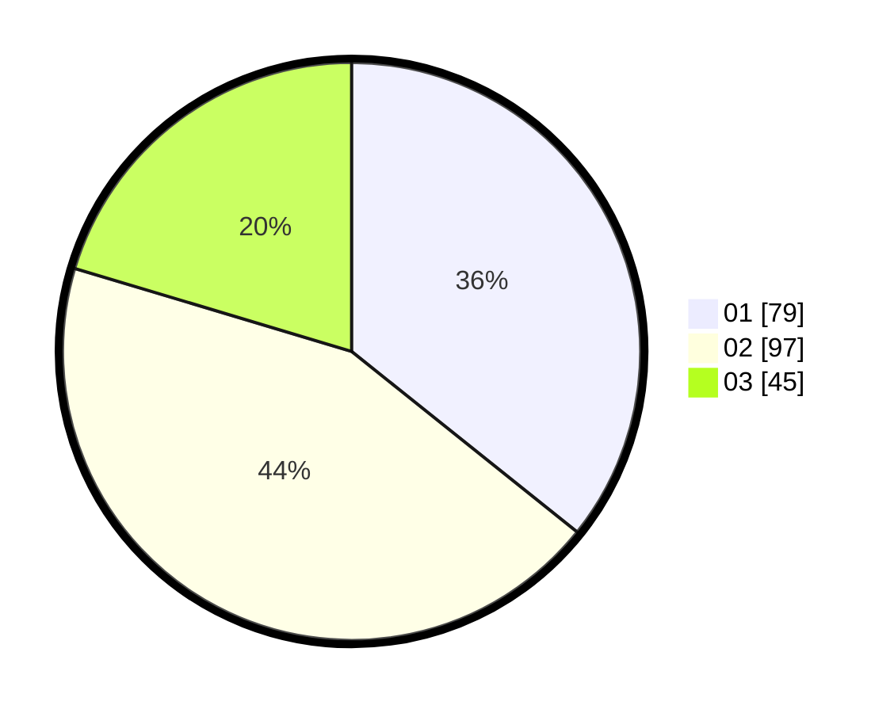

# Hasil

Hasil perolehan suara paslon dapat dilihat pada file paslon-01.txt, paslon-02.txt, dan paslon-03.txt.

Jika tidak ada, artinya data tersebut belum ada pada SIREKAP.

## Perolehan Suara

 * Paslon 01: **79**.
 * Paslon 02: **97**.
 * Paslon 03: **45**.

## Foto C Plano

https://sirekap-obj-formc.kpu.go.id/3a3b/pemilu/ppwp/31/75/08/10/01/3175081001024-20240214-191015--b707d7d6-d95c-4ceb-aab9-aa7ba7f81e74.jpg

https://sirekap-obj-formc.kpu.go.id/3a3b/pemilu/ppwp/31/75/08/10/01/3175081001024-20240214-213933--ce183380-29e8-4288-971a-ae3b96f40bec.jpg

https://sirekap-obj-formc.kpu.go.id/3a3b/pemilu/ppwp/31/75/08/10/01/3175081001024-20240214-210929--5736d6e3-d57d-4f04-8e08-38e0b07ec625.jpg

## DATA PEMILIH TETAP

Jumlah pemilih dalam DPT: **264**.
 * L: **128**.
 * P: **136**.

## DATA PENGGUNA HAK PILIH

Jumlah pengguna hak pilih dalam DPT: **222**.
 * L: **102**.
 * P: **120**.

Jumlah pengguna hak pilih dalam DPTb: **2**.
 * L: **1**.
 * P: **1**.

Jumlah pengguna hak pilih dalam DPK: **0**.
 * L: **0**.
 * P: **0**.

Jumlah pengguna hak pilih: **224**.
 * L: **103**.
 * P: **121**.

## JUMLAH SUARA SAH DAN TIDAK SAH

JUMLAH SELURUH SUARA SAH: **221**.

JUMLAH SUARA TIDAK SAH: **3**.

JUMLAH SELURUH SUARA SAH DAN SUARA TIDAK SAH: **224**.
