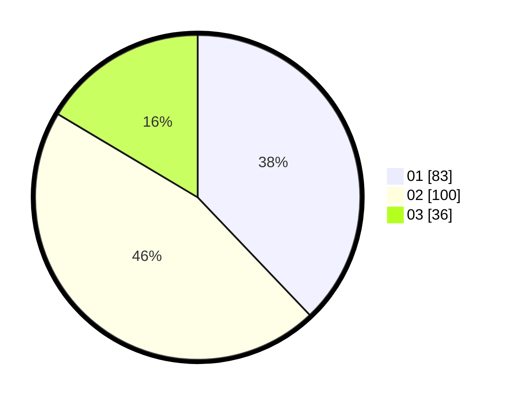

# Hasil

Hasil perolehan suara paslon dapat dilihat pada file paslon-01.txt, paslon-02.txt, dan paslon-03.txt.

Jika tidak ada, artinya data tersebut belum ada pada SIREKAP.

## Perolehan Suara

 * Paslon 01: **83**.
 * Paslon 02: **100**.
 * Paslon 03: **36**.

## Foto C Plano

https://sirekap-obj-formc.kpu.go.id/f094/pemilu/ppwp/31/75/08/10/01/3175081001025-20240216-014051--0f4039be-1427-4651-b789-d36e61e68266.jpg

https://sirekap-obj-formc.kpu.go.id/f094/pemilu/ppwp/31/75/08/10/01/3175081001025-20240216-014106--2334523c-d8f1-495c-84da-1d298016f91d.jpg

https://sirekap-obj-formc.kpu.go.id/f094/pemilu/ppwp/31/75/08/10/01/3175081001025-20240216-014101--329ebd3a-e906-40cb-b978-a3b75aa19a43.jpg

## DATA PEMILIH TETAP

Jumlah pemilih dalam DPT: **265**.
 * L: **121**.
 * P: **144**.

## DATA PENGGUNA HAK PILIH

Jumlah pengguna hak pilih dalam DPT: **217**.
 * L: **100**.
 * P: **117**.

Jumlah pengguna hak pilih dalam DPTb: **3**.
 * L: **1**.
 * P: **2**.

Jumlah pengguna hak pilih dalam DPK: **1**.
 * L: **0**.
 * P: **1**.

Jumlah pengguna hak pilih: **221**.
 * L: **101**.
 * P: **120**.

## JUMLAH SUARA SAH DAN TIDAK SAH

JUMLAH SELURUH SUARA SAH: **219**.

JUMLAH SUARA TIDAK SAH: **2**.

JUMLAH SELURUH SUARA SAH DAN SUARA TIDAK SAH: **221**.
