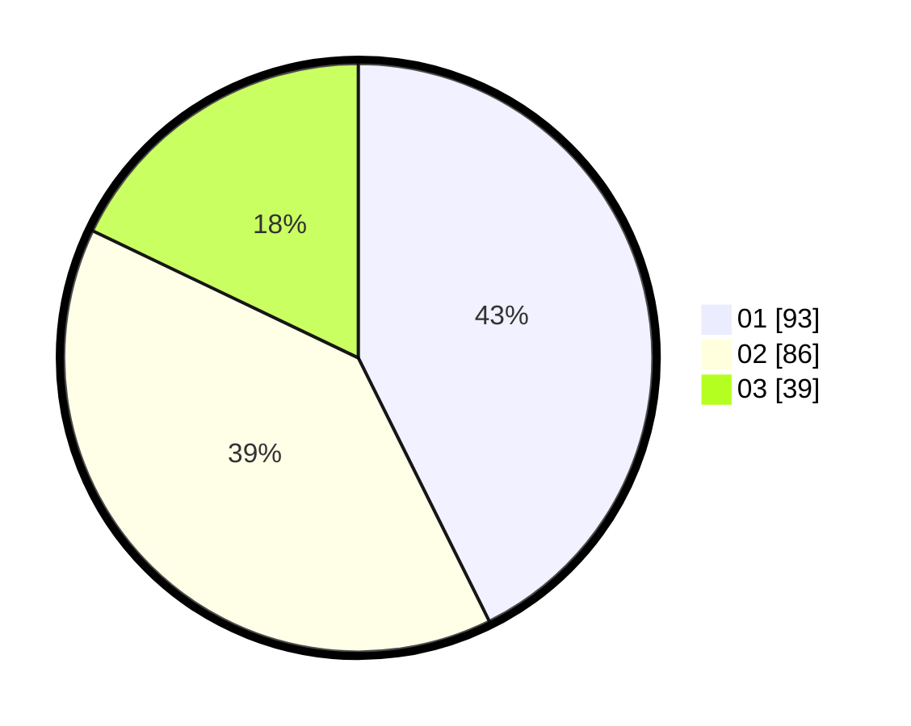

# Hasil

Hasil perolehan suara paslon dapat dilihat pada file paslon-01.txt, paslon-02.txt, dan paslon-03.txt.

Jika tidak ada, artinya data tersebut belum ada pada SIREKAP.

## Perolehan Suara

 * Paslon 01: **93**.
 * Paslon 02: **86**.
 * Paslon 03: **39**.

## Foto C Plano

https://sirekap-obj-formc.kpu.go.id/65ce/pemilu/ppwp/31/75/08/10/01/3175081001026-20240214-200524--e446201e-fd94-44ad-8c00-7facea7859f1.jpg

https://sirekap-obj-formc.kpu.go.id/65ce/pemilu/ppwp/31/75/08/10/01/3175081001026-20240214-210329--06f2dfc3-eef1-4387-9727-39f06f38654c.jpg
